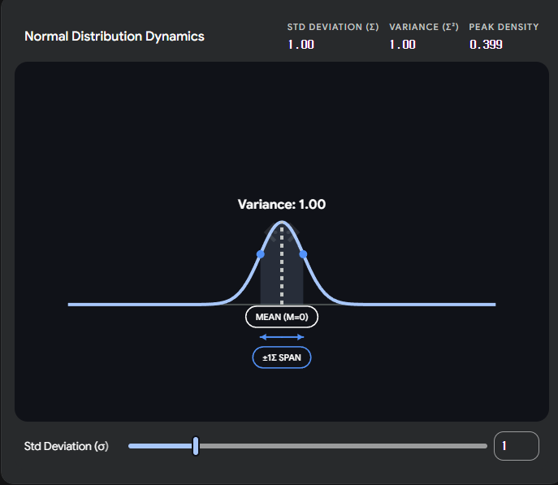
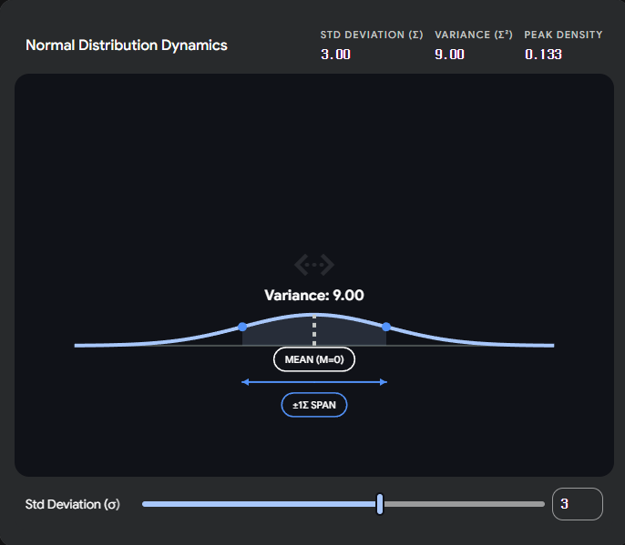
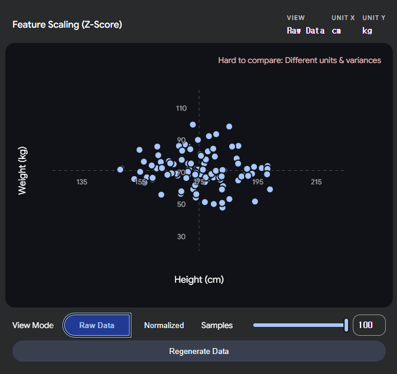

---

# ☑️ 학습(Training)과 추론(Inference)

## ✔️ 학습 vs 추론 차이점
|단계|순전파|역전파|
|-|-|-|
|**학습(Training)**|✅|✅|
|**추론(Inference)**|✅|❌|

## ⏳ 진행 과정
**학습(Training)** : 순전파 → 확률 출력 → *Loss(오차율) 계산 → 역전파(*미분) → w(가중치) 업데이트 → 반복
**추론(Inference)** : 순전파 → 확률 출력
*Loss(오차율) : 
*미분 : 

## 📜 python 코드
```python
# 학습 시
loss = criterion(output, label) 
loss.backward()                 # ← 역전파 실행
optimizer.step()                # ← w 업데이트
# 추론 시
with torch.no_grad():           # ← 역전파 그래프 생성 비활성화 (메모리/속도 절약)
    output = model(x)
```
- `torch.no_grad()` : 역전파 그래프 생성 비활성화
→ **학습 시**, `PyTorch`가 역전파를 위해 중간 계산값을 전부 메모리에 보관 
→ **추론 시**, 그럴 필요가 없음

---

# ☑️ Neural Network 구조

## ✔️ **뉴런(Neuron) 기본 구조**
``` text
진행 방향 →
              /       [🔵]
  [⚫️]        ㅡ      [🔵]
              \       [🔵]
    ↑         ↑         ↑
  start     weight     end
(시작 뉴런) (가중치)  (끝 뉴런)
```
✅ **뉴런(Neuron)** == **노드(Node)** == **유닛(Unit)**

## 📜 python 코드
```python
import torch.nn as nn

nn.Linear(24, 64)
          ↑    ↑
  in_features   out_features
 (이전 층 크기)  (다음 층 크기)
```

+) 생물학 용어(pre/post-synaptic)는 논문에서 쓰고, 실무에서는 "이전 층 출력", "다음 층 입력" 이렇게 부르는 게 일반적.

---

# ☑️MLP (다층 퍼셉트론)
✅ **MLP 주요 특징 : 입력 특징은 사용자가 직접 선택**
<div align="center">  </div>

> ---
> ## ✔️ Linear 24 → 64
> 
> ### ✍️ 정의
> ✅ **입력 뉴런 24개**를 **출력 뉴런 64개**로 연결하는 레이어 → **$w$(가중치) 행렬 24 × 64 = 1,536개** 학습.
> - 24개로는 표현력이 부족하므로 더 넓은 공간으로 **확장**해 **다양한 패턴 조합을 학습**하고, 이후 64→32→2 순으로 **압축**해 **최종 분류 점수 2개(배경/사람)를 출력**.
> ```
> 입력 24  →  확장 64  →  압축 32  →  출력 2
> (원본)     (패턴학습)   (핵심정제)  (분류)
> ```
>
> ### 🐍 동작 원리
> ✅ 각 **출력 뉴런 $y_n$** 는 입력 24개를 **서로 다른 비율로 섞은 조합**:
> <div align="center">  </div>
> 
> **전체 표기(뉴런 n개)**
> $$y_n = w_{n,0} \cdot x_0 + w_{n,1} \cdot x_1 + \cdots + w_{n,23} \cdot x_{23} + b$$
> 
> **시그마 표기** - **$x_0$(입력 값)** 에 대해서
> $$y_n = (\sum_{n=0}^{23} w_n \cdot x_0) + b$$
> 
> **백터 표기**
> $$y = w \cdot x + b$$
> 
> |약어|이름|정의|
> |-|-|-|
> |**$x$**|입력 값|이전 노드의 출력 / 현재 노드의 입력|
> |**$y$**|출력 값|현재 노드의 출력 / 다음 노드의 입력|
> |**$w$**|가중치|입력 신호의 세기 / 외부에서 들어오는 정보($x$)가 얼마나 중요한지를 결정|
> |**$b$**|편향|뉴런의 민감도 / 외부 정보와 상관없이, 이 뉴런 자체가 기본적으로 가지고 있는 성질|
> 
> ✅ **$y$(출력 값)** = 들어온 **✅ $\cdot$ $x$(입력 값)** 를 전부 더하고 **$b$(편향)** 추가
> **$$y_n = (\sum_{n=0}^{23} w_n \cdot x_0) + b$$**
> → **(이전 층의 출력 y = 다음 층의 입력 x — 이 패턴이 층마다 반복됨)**
>> ---
>> #### ❓ $b$ (bias, 편향) 는 누가 만드는가?
>> **$b$(편향)** 는 **특정 $x$(입력)** 에서 오는 게 아니라, **출력 뉴런 자체적으로 갖고 있는 오프셋**.
>> - **$w$(가중치) = 연결 선**에 있음 — 입력 값마다 하나씩 (24개 입력 → 24개 $w$(가중치))
>> - **$b$(편향) = 출력 뉴런** 에 있음 — 뉴런 하나당 하나 (입력 개수와 무관)
>> ```
>> x₀ ——w₁₀——→ ⊕ 
>> x₁ ——w₁₁——→ ⊕ → y₁
>> x₂ ——w₁₂——→ ⊕
>>                  ↑
>>                  b₁
>>    (출력 뉴런이 자체적으로 갖는 오프셋)
>> ```
>> 1. $y_1$ 노드의 각 연결에서 $y_1$ = $w_{1,0} \cdot x_0 + \ w_{1,1} \cdot x_1 + \cdots + \ w_{1,n} \cdot x_n$ ← **선($w$)** 이 하는 일
>> 2. $y_1$ 노드에서: 1. + $b_1$ 추가 ← **노드($b$)** 가 하는 일
>>
>> ✅ $w$(가중치)와 똑같이 **모델이 학습으로 스스로 만듦.** — 처음엔 0 또는 랜덤으로 초기화되고, 역전파로 자동 업데이트.
>>
>> $b$ 가 없으면 → 반드시 원점을 지나는 직선(유연성 없음)
>> **$$y(출력 값) = w(가중치) \cdot x(입력 값)$$**
>>
>> $b$ 가 있으면 → 직선을 위아래로 자유롭게 이동 가능
>> **$$y(출력 값) = w(가중치) \cdot x(입력 값) + b(편향)$$**
>>
>> ---
>
> | |$w$ (가중치)|$b$ (편향)|
> |-|-|-|
> |**초기값**|랜덤|보통 0 또는 랜덤|
> |**업데이트**|역전파 자동|역전파 자동|
> |**역할**|**기울기 조절**|**출력 위치 이동**|
> |**관여자**|모델 자동 학습|모델 자동 학습|
>
> `nn.Linear(24, 64)` 선언 시 `PyTorch`가 $w(가중치)$ 1536개 + $b(편향)$ 64개를 자동 생성
> - 64개 뉴런이 **같은 입력을 64가지 방식으로 조합**해 **서로 다른 패턴(에너지 패턴, 피크 위치 등)을 감지**.
> 
> ---

> ---
> ## ✔️ BatchNorm1d
> 
> ### ✍️ 정의
> **배치 정규화 과정** → Linear 통과 후 값 범위가 제멋대로 커지는 것을 **평균 0, 분산 1**로 맞춰 안정화.
> 
> ✅ **배치(Batch)** : 한 번에 모델에 넣어서 학습하는 샘플 묶음 / 코드에서 `BATCH_SIZE = 16` → 첫 번째 배치는 csv 샘플 1~16번.
> ```
> 전체 N개
> ├── 배치 1:  샘플  1 ~ 16  → 모델 통과 → 가중치 업데이트
> ├── 배치 2:  샘플 17 ~ 32  → 모델 통과 → 가중치 업데이트
> │   ...
> └── 마지막 배치 → 이 한 사이클 = 1 Epoch
> ```
> |방법|설명|문제|
> |-|-|-|
> |1개씩|샘플 1개마다 업데이트|노이즈 심해서 불안정|
> |**배치(16개)**|묶어서 평균 내서 업데이트|안정 + 빠름|
> |전체 한꺼번에|전체 평균 내서 업데이트|메모리 부족, 느림|
>
> ✅ **정규화(Normalization)** : 보통 데이터의 범위를 0에서 1 사이로 압축하는 과정 / 데이터의 최솟값과 최댓값을 확실히 알 때, 혹은 이미지 데이터(0 ~ 255 픽셀 값)를 다룰 때 주로 사용
> $$x_{new} = \frac{x - x_{min}}{x_{max} - x_{min}}$$
> |약어|이름|정의|입력예시|
> |-|-|-|-|
> 
> ✅ **표준화(Standardization)** : 데이터를 평균 0, 분산 1인 표준정규분포로 만드는 과정 / 데이터에 아웃라이어(이상치)가 많을 때 유리
> $$\hat{x} = \frac{x - \mu_{batch}}{\sqrt{\sigma^2_{batch} + \epsilon}}$$
> |약어|이름|정의|입력예시|
> |-|-|-|-|
> |**$x$**|입력|정규화 전 원본 값|3.7|
> |**$\mu_{batch}$**|평균|현재 배치의 평균값 |48.55|
> |**$x - \mu_{batch}$**|중심 이동|중심을 0으로 이동|3.7 - 48.55 = -44.85| ? 무게중심인가
> |**$\sigma^2_{batch}$**|분산|값들이 평균에서 얼마나 퍼져있는가|2208.0|
> |**$\sqrt{\sigma^2_{batch}}$**|표준편차|분산의 제곱근|47.0|
> |**$\epsilon$**|아주 작은 상수|분모가 0이 되는 것을 막는 아주 작은 수|0.00001|
> |**$\hat{x}$**|출력|정규화 완료된 출력값|-44.85 / 47.0 ≈ -0.95|
> ```
> 정규화 전   : [3.7   , 102.4, 0.003,  88.1 ] ← 중심도 범위도 제각각
> 평균 0 처리 : [-44.85, 53.85, -48.55, 39.55] ← 중심을 0으로 이동
> 분산 1 처리 : [-0.95 , 1.15 , -1.03,  0.84 ] ← 범위까지 통일
> ```
>> ---
>> #### ❓ **분산(Variance)**
>> 데이터가 평균에서 **얼마나 흩어져 있는가**를 나타내는 수치.
>> <div align="center">  </div>
>> <div align="center">  </div>
>>
>> 예시 `[3.7, 102.4, 0.003, 88.1]`$_{batch}$ 기준 :
>> 1. 평균(**$\mu_{batch}$**) : $(3.7 + 102.4 + 0.003 + 88.1) \div 4 = 194.203 \div 4 \approx 48.55$
>> 2. 편차(**$x_i - \mu_{batch}$**) : $3.7 - 48.55 = -44.85$, $102.4 - 48.55 = 53.85$, $0.003 - 48.55 = -48.55$, $88.1 - 48.55 = 39.55$
>> 3. 각 편차 제곱의 합(**$\sum(x_i - \mu_{batch})^2$**) : $(-44.85)^2 + (53.85)^2 + (-48.55)^2 + (39.55)^2 = 8832.64$
>> ❓ **제곱을 하는 이유** : **방향성(음수) 제거** / 큰 차이에 대한 가중치
>> 4. 분산(**$\sigma^2_{batch}$**) : $8832.64 \div 4 \approx 2208$
>> 5. 표준편차(**$\sqrt{\sigma^2_{batch}}$**) = $\sqrt{2208} \approx 47$ → 이걸로 나눠서 범위 통일
>>
>> |데이터|분산|의미|
>> |-|-|-|
>> |`[5, 5, 5, 5]`|0|모두 똑같음, 흩어짐 없음|
>> |`[1, 3, 7, 9]`|~10|조금 흩어짐|
>> |`[3.7, 102.4, 0.003, 88.1]`|~2208|많이 흩어짐 → **BatchNorm이 눌러줌**|
>>
>> #### ❓ **표준편차(Standard Deviation)**
>> 데이터가 평균에서 **평균적으로 얼마나 떨어져 있는가**를 나타내는 수치.
>> <div align="center">  </div>
>> <div align="center">  </div>
>>
>> **각 편차 값(평균에서 떨어진 거리)** 을 평균 거리(47)로 나누면 **상대적 크기**만 남음: 
>> $$\frac{-44.85}{47} \approx -0.95, \frac{53.85}{47} \approx 1.15, \frac{-48.55}{47} \approx -1.03, \frac{39.55}{47} \approx 0.84$$
>> 결과가 `[-1 ~ +1]` 범위로 수렴
>> - 수학적으로 **$x$(입력)** 를 **$\sigma$(표준편차)** 로 나누면 분산이 정확히 1
>> $$\text{Variance}\!\left(\frac{x}{\sigma}\right) = \frac{1}{\sigma^2} \cdot \text{Variance}(x) = \frac{1}{\sigma^2} \cdot \sigma^2 = 1$$
>>
>> 예시 `[10, 20, 30]`$_{batch}$ 기준
>> 1. 평균(**$\mu_{batch}$**) : $(10 + 20 + 30) \div 3 = 60 \div 3 = 20$
>> 2. 편차(**$x_i - \mu_{batch}$**) : $10 - 20 = -10$, $20 - 20 = 0$, $30 - 20 = 10$
>> 3. 각 편차 제곱의 합(**$\sum(x_i - \mu_{batch})^2$**) : $(-10)^2 + (0)^2 + (10)^2 = 100 + 0 + 100 = 200$
>> 4. 분산(**$\sigma^2_{batch}$**) : $200 \div 3 \approx 66.67$
>> 5. 표준편차(**$\sqrt{\sigma^2_{batch}}$**) = $\sqrt{66.67} \approx 8.165$ → 이걸로 나눠서 범위 통일
>>
>> 표준편차($\sigma=8.165$)로 데이터 나누기($x_{new} = \frac{x}{8.165}$)
>> `[1.225, 2.449, 3.674]`$_{new}$
>> 1. 평균(**$\mu_{new}$**) : $(1.225 + 2.449 + 3.674) \div 3 \approx 2.449$
>> 2. 편차(**$x_i - \mu_{new}$**) : $1.225 - 2.449 = -1.224$, $2.449 - 2.449 = 0$, $3.674 - 2.449 = 1.225$
>> 3. 각 편차 제곱의 합(**$\sum(x_i - \mu_{new})^2$**) : $(-1.224)^2 + (0)^2 + (1.225)^2 \approx 3.0$
>> 4. 분산(**$\sigma^2_{new}$**) : $3.0 \div 3 = \mathbf{1.0}$ ✅ ← 분산이 정확히 1
>> 5. 표준편차(**$\sqrt{\sigma^2_{new}}$**) = $\sqrt{1.0} = \mathbf{1.0}$ ✅
>>
>> #### ❓ **1로 맞추는 이유** : **폭주 방지** / **균형 잡힌 학습** / **ReLU**
>> **폭주 방지** : 레이어를 지날수록 값이 기하급수적으로 커지거나 작아지는 것을 막아줌.
>> **균형 잡힌 학습** : 여러 개의 입력 신호가 있을 때, 어떤 놈은 범위가 크고 어떤 놈은 작으면 범위가 큰 놈이 학습을 주도 → 모든 분산을 1로 맞추면 **모든 신호가 동일한 영향력**을 갖게 됨.
>> **ReLU** : ReLU는 음수를 전부 0으로 죽임. 값이 양수 쪽으로 치우치면 대부분의 뉴런이 살아남고 패턴 구분 능력이 떨어짐. **평균을 0으로 맞추면 양수/음수가 균형** → ReLU 통과 후에도 뉴런 절반이 활성화 → 다양한 패턴 유지.
>>
>> |정규화|없음|있음|
>> |-|-|-|
>> |**학습 안정성**|층마다 스케일 달라 불안정|**항상 같은 범위** → 안정|
>> |**ReLU 사망**|치우친 값 → 뉴런 대부분 죽음|**균형** → 절반 살아남음|
>> |**학습 속도**|느림|**빠름**|
>> ---
>
> ### 🐍 동작 원리
> 
> ✅ **같은 특징(feature) 채널**에 속한 배치 내 샘플들의 값을 모아 **평균·분산으로 정규화**한 뒤, 학습 가능한 **$\gamma$(스케일) · $\beta$(이동)** 로 복원:
>
>> ---
>> #### ❓ **"같은 특징 채널이란?"**
>> 배치 행렬에서 **같은 열(column)**
>> ```
>>           특징0  특징1  특징2  ...  특징63
>> 샘플1   [ 3.7,   1.2,   0.5,  ...,  8.1 ]
>> 샘플2   [ 2.1,   4.3,   1.9,  ...,  3.4 ]
>> 샘플3   [ 5.5,   0.8,   2.2,  ...,  6.7 ]
>> ...
>> 샘플16  [ 1.3,   3.1,   0.9,  ...,  2.8 ]
>>           ↑ 이 열 16개를 모아서 정규화 (채널 0)
>> ```
>> - 특징0 채널 → `[3.7, 2.1, 5.5, ..., 1.3]` 16개 → 평균·분산 계산 → 정규화
>> - 특징1 채널 → `[1.2, 4.3, 0.8, ..., 3.1]` 16개 → 평균·분산 계산 → 정규화
>> - 64개 채널 각각 **독립적으로** 처리 → 채널마다 자기만의 **$\mu$(평균)**, **$\sigma^2$(표준편차)**, $\gamma$, $\beta$ 보유
> ```
> 입력 배치 (16샘플 × 64특징)
>  ↓
> 특징 채널 k 하나를 세로로 뽑으면 → [x₁ₖ, x₂ₖ, ..., x₁₆ₖ]  ← 16개 값
>  ↓ ① 평균·분산 계산
>  ↓ ② 정규화 (평균 0, 분산 1)
>  ↓ ③ γ·x̂ + β  (스케일/이동 복원)
> 출력: 값 범위가 안정된 64개 특징
> ```
>
> **수식 — 채널 $k$에 대해 (배치 크기 $B$)**
>
> **① 평균**
> - $\mu_k = \dfrac{1}{B} \sum_{i=1}^{B} x_{i,k}$
>
> **② 분산**
> - $\sigma_k^2 = \dfrac{1}{B} \sum_{i=1}^{B} (x_{i,k} - \mu_k)^2$
>
> **③ 정규화**
> - $\hat{x}_{i,k} = \dfrac{x_{i,k} - \mu_k}{\sqrt{\sigma_k^2 + \varepsilon}}$
>
> **④ 스케일 · 이동 (학습 파라미터)**
> - $y_{i,k} = \gamma_k \cdot \hat{x}_{i,k} + \beta_k$
>
> |기호|이름|설명|
> |-|-|-|
> |**$\mu_k$**|배치 평균|채널 $k$의 배치 내 평균|
> |**$\sigma_k^2$**|배치 분산|채널 $k$의 배치 내 분산|
> |**$\hat{x}$**|정규화된 값|평균 0, 분산 1로 맞춤|
> |**$\varepsilon$**|엡실론|분모 0 방지용 아주 작은 값 (기본 `1e-5`)|
> |**$\gamma_k$**|스케일|채널별 학습 가능한 크기 조정 파라미터|
> |**$\beta_k$**|이동|채널별 학습 가능한 이동 파라미터|
>
>> ---
>> #### ❓ 왜 정규화 후 다시 $\gamma \cdot \hat{x} + \beta$ 를 하는가?
>> 정규화만 하면 활성화 값이 항상 평균 0·분산 1로 고정되어 **표현력이 오히려 줄어들 수 있음**.
>> → $\gamma$(스케일) · $\beta$(이동)를 역전파로 학습시켜, **필요하면 원래 범위를 복원**할 수 있도록 유연성을 유지.
>> - **$\gamma = 1, \beta = 0$** 이면 정규화 그대로 유지
>> - **학습을 통해 최적값으로 자동 수렴**
>> ---
>
> | |$\gamma$ (스케일)|$\beta$ (이동)|
> |-|-|-|
> |**초기값**|1|0|
> |**업데이트**|역전파 자동|역전파 자동|
> |**역할**|**정규화 후 크기 복원**|**정규화 후 위치 복원**|
> |**관여자**|모델 자동 학습|모델 자동 학습|
>
> `nn.BatchNorm1d(64)` 선언 시 `PyTorch`가 $\gamma$(스케일) 64개 + $\beta$(이동) 64개를 자동 생성
> - **학습 중**: 배치마다 실시간 $\mu$·$\sigma^2$ 계산 후 정규화
> - **추론 중**: 학습 중 누적한 **이동 평균(running_mean)** · **이동 분산(running_var)** 사용 → 배치 크기에 무관하게 안정적 동작
>
> ```python
> nn.BatchNorm1d(64)
>                ↑
>          num_features (이전 Linear 출력 크기와 일치해야 함)
> ```
> 
> ---
