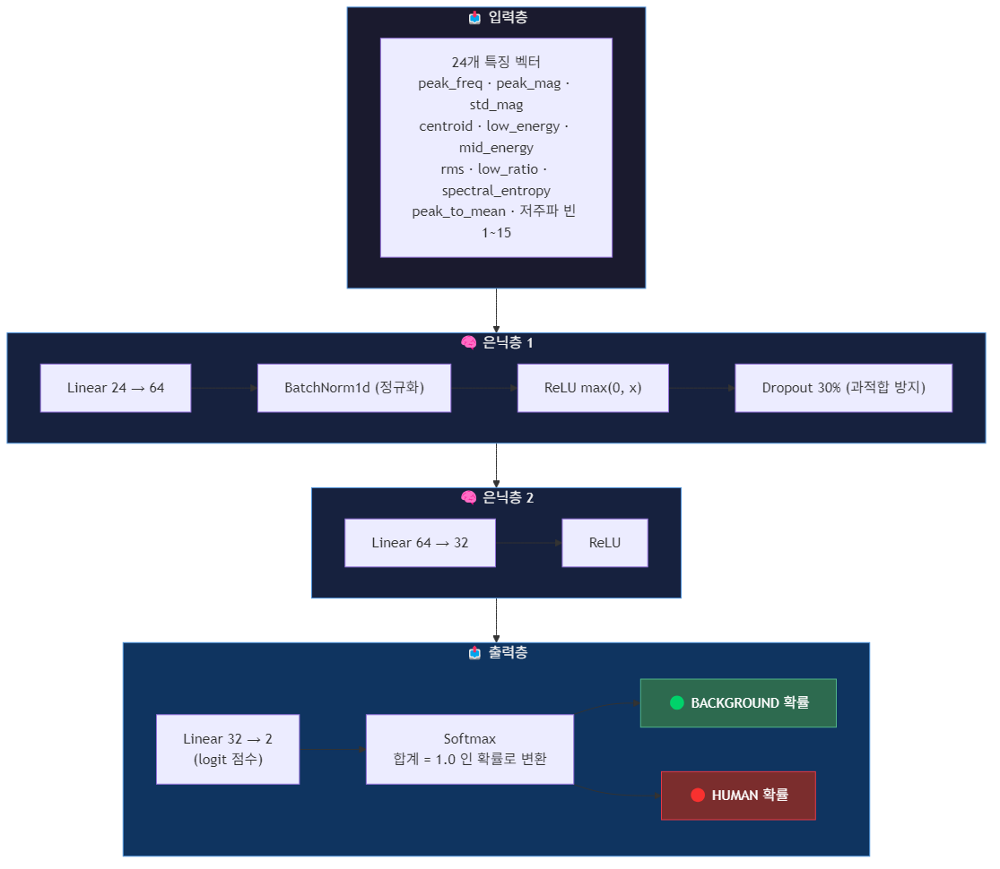
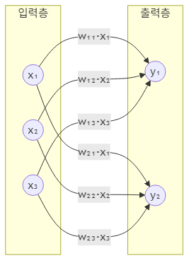

---
# ☑️ 학습(Training)과 추론(Inference)
## ✔️ 학습 vs 추론 차이점
|단계|순전파|역전파|
|-|-|-|
|**학습(Training)**|✅|✅|
|**추론(Inference)**|✅|❌|
## ⏳ 진행 과정
**학습(Training)** : 순전파 → 확률 출력 → <b>*Loss(오차율)</b> 계산 → 역전파(<b>*미분</b>) → w(가중치) 업데이트 → 반복
**추론(Inference)** : 순전파 → 확률 출력
<b>*Loss(오차율)</b> : 
<b>*미분</b> : 
## 📜 python 코드
```python
# 학습 시
loss = criterion(output, label) 
loss.backward()                 # ← 역전파 실행
optimizer.step()                # ← w 업데이트
# 추론 시
with torch.no_grad():           # ← 역전파 그래프 생성 비활성화 (메모리/속도 절약)
    output = model(x)
```
- `torch.no_grad()` : 역전파 그래프 생성 비활성화
→ **학습 시**, `PyTorch`가 역전파를 위해 중간 계산값을 전부 메모리에 보관 
→ **추론 시**, 그럴 필요가 없음

---
# ☑️ Neural Network 구조
## ✔️ **뉴런 기본 구조**
``` text
진행 방향 →
              /       [🔵]
  [⚫️]        ㅡ      [🔵]
              \       [🔵]
    ↑         ↑         ↑
  start     weight     end
(시작 뉴런) (가중치)  (끝 뉴런)
```
✅ **뉴런(Neuron)** == **노드(Node)** == **유닛(Unit)**

|위치|설명|
|-|-|
|시작 뉴런|**Pre-synaptic Neuron**|
|끝 뉴런|**Post-synaptic Neuron**|
|선|**Weight**|

```python
import torch.nn as nn

nn.Linear(24, 64)
          ↑    ↑
  in_features   out_features
 (이전 층 크기)  (다음 층 크기)
```
+) 생물학 용어(pre/post-synaptic)는 논문에서 쓰고, 실무에서는 "이전 층 출력", "다음 층 입력" 이렇게 부르는 게 일반적.

---
# ☑️MLP (다층 퍼셉트론)
✅ **MLP 주요 특징 : 입력 특징은 사용자가 직접 선택**

<div align="center">  </div>

> ## ✔️ Linear 24 → 64
> ### ✍️ 정의
> ``` text
> 입력 24  →  확장 64  →  압축 32  →  출력 2
> (원본)     (패턴학습)   (핵심정제)  (분류)
> ```
> ✅ **입력 뉴런 24개**를 **출력 뉴런 64개**로 연결하는 레이어 → **가중치 행렬 24 × 64 = 1,536개** 학습.
> - 24개로는 표현력이 부족하므로 더 넓은 공간으로 **확장**해 다양한 패턴 조합을 학습하고, 이후 64→32→2 순으로 **압축**해 최종 분류 점수 2개(배경/사람)를 출력.

> ### 🐍 동작 원리
> ✅ 각 출력 뉴런 $y_n$ 는 입력 24개를 서로 다른 비율로 섞은 조합:
> <div align="center">  </div>
> 
> **전체 표기(뉴런 n개)**
> - $y_n = w_{n,0} \cdot x_0 + w_{n,1} \cdot x_1 + \cdots + w_{n,23} \cdot x_{23} + b$
> 
> **시그마 표기** - **$x_0$(입력 값)** 에 대해서
> - $y_n = (\sum_{n=0}^{23} w_n \cdot x_0) + b$
> 
> **백터 표기**
> - $y = w \cdot x + b$
> 
> $y$ = 들어온 **$w(가중치)$ $\cdot$ $x(입력 값)$** 를 전부 더하고 **$b$** 추가 → **$y_n = (\sum_{n=0}^{23} w_n \cdot x_0) + b$**
> - **이전 층의 출력 y = 다음 층의 입력 x — 이 패턴이 층마다 반복됨**

> #### ❓ $b$ (bias, 편향) 는 누가 만드는가?
> **$w$와 $b$의 위치 차이**
> - $w$ = **연결선**에 있음 — 입력 $x$마다 하나씩 (24개 입력 → 24개 $w$)
> - $b$ = **출력 뉴런(노드)** 에 있음 — 뉴런 하나당 하나 (입력 개수와 무관)
> ```
> x₀ ——w₁₀——→ ⊕ → y₁
> x₁ ——w₁₁——→ ⊕
> x₂ ——w₁₂——→ ⊕
>                ↑
>               b₁ (출력 뉴런이 자체적으로 갖는 오프셋)
> ```
> 계산 순서:
> 1. 각 연결에서: $w_{1,0} \cdot x_0,\ w_{1,1} \cdot x_1, \cdots$ ← **선($w$)** 이 하는 일
> 2. $y_1$ 노드에서: 전부 더하기 + $b_1$ 추가 ← **노드($b$)** 가 하는 일
>
> $b$는 특정 $x$에서 오는 게 아니라, 출력 뉴런이 **자체적으로 갖고 있는 오프셋**이므로 시그마 밖에 위치.
>
> $w$ 와 똑같이 — **모델이 학습으로 스스로 만듦.** 처음엔 0 또는 랜덤으로 초기화되고, 역전파로 자동 업데이트.
>
> $b$ 가 없으면:
> $$y = w \cdot x \quad \text{(반드시 원점을 지나는 직선 — 유연성 없음)}$$
>
> $b$ 가 있으면:
> $$y = w \cdot x + b \quad \text{(직선을 위아래로 자유롭게 이동 가능)}$$
>
> | | $w$ (가중치) | $b$ (편향) |
> |--|--|--|
> | 초기값 | 랜덤 | 보통 0 또는 랜덤 |
> | 업데이트 | 역전파 자동 | 역전파 자동 (동일) |
> | 역할 | 기울기 조절 | 출력 위치 이동 |
> | 관여자 | 모델 자동 학습 | 모델 자동 학습 |
>
> `nn.Linear(24, 64)` 선언 시 PyTorch가 $w$ 1536개 + $b$ 64개를 자동 생성, 학습 중 둘 다 자동 업데이트. 사람이 직접 건드리지 않음.

64개 뉴런이 같은 입력을 **64가지 방식으로 조합**해 서로 다른 패턴(에너지 패턴, 피크 위치 등)을 감지.  
이후 64→32→2 로 **압축**해 최종 분류 점수 출력:
```
입력 24  →  확장 64  →  압축 32  →  출력 2
 (원본)     (패턴학습)   (핵심정제)  (분류)
```