npm install --save-dev @mermaid-js/mermaid-cli
ctrl + shift + v

# 딥러닝 모델 구조 다이어그램

> **학습 단계 vs 추론 단계 — 순전파/역전파 언제 일어나는가?**
>
> | 단계 | 순전파 | 역전파 |
> |------|--------|--------|
> | **학습 (training)** | ✅ 일어남 | ✅ 일어남 |
> | **추론 (inference)** | ✅ 일어남 | ❌ 없음 |
>
> **학습** = 순전파 → Loss 계산 → 역전파 → $w$ 업데이트 → 반복  
> **추론** = 순전파만 → 출력(확률) 반환
>
> 역전파는 $w$를 수정하는 과정이므로, 학습이 끝나 $w$가 확정된 뒤엔 필요 없음.
>
> 코드에서도 그 차이가 명확히 보임:
> ```python
> # 학습 시
> loss = criterion(output, label)
> loss.backward()       # ← 역전파 실행
> optimizer.step()      # ← w 업데이트
>
> # 추론 시
> with torch.no_grad(): # ← 역전파 그래프 생성 비활성화 (메모리/속도 절약)
>     output = model(x)
> ```
> `torch.no_grad()` = "역전파용 계산 그래프를 만들지 마라" 선언.  
> 학습 시엔 PyTorch가 역전파를 위해 중간 계산값을 전부 메모리에 보관하는데, 추론 시엔 그럴 필요가 없어서 이걸 끔.

> **뉴런 연결선의 양쪽을 뭐라고 부르는가?**
>
> | 위치 | 용어 | 설명 |
> |------|------|------|
> | 선의 출발점 (값을 보내는 쪽) | **이전 뉴런 / 이전 층** | pre-synaptic neuron |
> | 선의 도착점 (값을 받는 쪽) | **다음 뉴런 / 다음 층** | post-synaptic neuron |
> | 선 자체 | **가중치 $w$** | 얼마나 전달할지 비율 |
> | 뉴런 하나 | **노드(node) / 유닛(unit)** | 둘 다 같은 말 |
>
> 코드에서도 그대로 나타남:
> ```python
> nn.Linear(24, 64)
>           ↑    ↑
>      in_features  out_features
>      (이전 층 크기)  (다음 층 크기)
> ```
> 생물학 용어(pre/post-synaptic)는 논문에서 쓰고, 실무에서는 "이전 층 출력 $x$", "다음 층 입력" 이렇게 부르는 게 일반적.

---

## MLP (다층 퍼셉트론)

> **입력 특징은 사람이 직접 선택한다** — `svm.py`의 `A_feature_indices` (저주파 빈 1~15 + 통계 10개 = 24개).  
> CNN과 달리 도메인 지식으로 중요한 특징을 골라 넣어야 함.


``<!-- source: images/diagram_01.mmd -->``
---
### 🔷 `Linear 24 → 64` 이란?
`y = W·x + b` 연산. 입력 뉴런 24개를 64개로 연결하는 가중치 행렬 **(64×24)** 을 학습.  
24개로는 표현력이 부족하므로 더 넓은 공간으로 **확장**해 다양한 패턴 조합을 학습하고,  
이후 64→32→2 순으로 **압축**해 최종 분류 점수 2개(배경/사람)를 출력.

```
입력 24  →  확장 64  →  압축 32  →  출력 2
 (원본)     (패턴학습)   (핵심정제)  (분류)
```

### 🔷 `Linear 24 → 64` 동작 원리
입력 24개 뉴런이 출력 64개 뉴런 **전부에 연결** → 가중치 24×64 = **1,536개** 학습.  
각 출력 뉴런 $y_j$ 는 입력 24개를 **서로 다른 비율로 섞은 조합**:

$$y_j = w_{j,0}x_0 + w_{j,1}x_1 + \cdots + w_{j,23}x_{23} + b_j$$

**구조 시각화** (간략화: 3→2, 실제는 24→64):


``<!-- source: images/diagram_02.mmd -->``

> - **선(라인)**: 각 $w \cdot x$ — 입력에 가중치를 곱한 값이 전달됨  
> - **출력 노드 $y_j$**: 들어온 $w \cdot x$ 를 전부 더하고 $b_j$ 추가 → $y_j = \sum w \cdot x + b$  
> - **이전 층의 출력 $y$ = 다음 층의 입력 $x$** — 이 패턴이 층마다 반복됨

> **$b$ (bias, 편향) 는 누가 만드는가?**
>
> $w$ 와 똑같이 — **모델이 학습으로 스스로 만듦.** 처음엔 0 또는 랜덤으로 초기화되고, 역전파로 자동 업데이트.
>
> $b$ 가 없으면:
> $$y = w \cdot x \quad \text{(반드시 원점을 지나는 직선 — 유연성 없음)}$$
>
> $b$ 가 있으면:
> $$y = w \cdot x + b \quad \text{(직선을 위아래로 자유롭게 이동 가능)}$$
>
> | | $w$ (가중치) | $b$ (편향) |
> |--|--|--|
> | 초기값 | 랜덤 | 보통 0 또는 랜덤 |
> | 업데이트 | 역전파 자동 | 역전파 자동 (동일) |
> | 역할 | 기울기 조절 | 출력 위치 이동 |
> | 관여자 | 모델 자동 학습 | 모델 자동 학습 |
>
> `nn.Linear(24, 64)` 선언 시 PyTorch가 $w$ 1536개 + $b$ 64개를 자동 생성, 학습 중 둘 다 자동 업데이트. 사람이 직접 건드리지 않음.

64개 뉴런이 같은 입력을 **64가지 방식으로 조합**해 서로 다른 패턴(에너지 패턴, 피크 위치 등)을 감지.  
이후 64→32→2 로 **압축**해 최종 분류 점수 출력:
```
입력 24  →  확장 64  →  압축 32  →  출력 2
 (원본)     (패턴학습)   (핵심정제)  (분류)
```

---
### 🔶 `BatchNorm1d` — 배치 정규화

**배치(Batch)** = 한 번에 모델에 넣어서 학습하는 샘플 묶음. 코드에서 `BATCH_SIZE = 16` → 첫 번째 배치는 csv 샘플 1~16번.

```
전체 N개
├── 배치 1:  샘플  1 ~ 16  → 모델 통과 → 가중치 업데이트
├── 배치 2:  샘플 17 ~ 32  → 모델 통과 → 가중치 업데이트
│   ...
└── 마지막 배치 → 이 한 사이클 = 1 Epoch
```

| 방법 | 설명 | 문제 |
|------|------|------|
| 1개씩 | 샘플 1개마다 업데이트 | 노이즈 심해서 불안정 |
| **배치(16개)** | 묶어서 평균 내서 업데이트 | **안정 + 빠름** ✅ |
| 전체 한꺼번에 | 전체 평균 내서 업데이트 | 메모리 부족, 느림 |

Linear 통과 후 값 범위가 제멋대로 커지는 것을 **평균 0, 분산 1**로 맞춰 안정화.

$$\hat{x} = \frac{x - \mu_{batch}}{\sqrt{\sigma^2_{batch} + \epsilon}}$$

| 항목 | 의미 | 예시 |
|------|------|------|
| $x$ | 정규화 전 원본 값 | `3.7` |
| $\mu_{batch}$ | 현재 배치의 **평균값** | `48.55` |
| $x - \mu_{batch}$ | 평균을 빼서 중심을 0으로 이동 | `3.7 - 48.55 = -44.85` |
| $\sigma^2_{batch}$ | 현재 배치의 **분산** (값들이 평균에서 얼마나 퍼져있는가) | `2208.0` |
| $\sqrt{\sigma^2_{batch}}$ | **표준편차** (분산의 제곱근) | `47.0` |
| $\epsilon$ | 분모가 0이 되는 것을 막는 아주 작은 수 | `0.00001` |
| $\hat{x}$ | 정규화 완료된 출력값 | `-44.85 / 47.0 ≈ -0.95` |

```
정규화 전:  [ 3.7,    102.4,   0.003,   88.1 ]  ← 중심도 범위도 제각각
평균 0 처리: [-44.85,   53.85, -48.55,   39.55]  ← 중심을 0으로 이동
분산 1 처리: [ -0.95,    1.15,  -1.03,    0.84]  ← 범위까지 통일
```

> **분산(Variance)** = 데이터가 평균에서 **얼마나 흩어져 있는가**를 나타내는 수치.  
> 예시 `[3.7, 102.4, 0.003, 88.1]` 기준:
> 1. 평균: $(3.7 + 102.4 + 0.003 + 88.1) \div 4 = 194.203 \div 4 \approx 48.55$  
> 2. 각 값이 평균에서 벗어난 거리 제곱: $(-44.85)^2 + (53.85)^2 + (-48.55)^2 + (39.55)^2$  
> 3. 그 평균 = **분산** $= 8832.64 \div 4 \approx 2208$  
> 4. 표준편차 = $\sqrt{2208} \approx 47$ → 이걸로 나눠서 범위 통일  
>    - 표준편차 = "데이터가 평균에서 평균적으로 얼마나 떨어져 있는가" → 평균 거리 **47**  
>    - 각 값을 **자신의 평균 거리(47)로 나누면** 상대적 크기만 남음:  
>      $\frac{-44.85}{47} \approx -0.95$,  $\frac{53.85}{47} \approx 1.15$,  $\frac{-48.55}{47} \approx -1.03$,  $\frac{39.55}{47} \approx 0.84$  
>    - 결과가 `-1 ~ +1` 범위로 수렴 → 수학적으로 $x$를 $\sigma$로 나누면 분산이 정확히 1:  $\text{새 분산} = \frac{\sigma^2}{\sigma^2} = 1$  
>    - 비유: 키 160/175/155cm → "평균(163cm)에서 얼마나 차이 나는가" 비율로 표현 → 단위 달라도 **상대 크기는 동일하게** 비교 가능  
>
> | 데이터 | 분산 | 의미 |
> |--------|------|------|
> | `[5, 5, 5, 5]` | **0** | 모두 똑같음, 흩어짐 없음 |
> | `[1, 3, 7, 9]` | **~10** | 조금 흩어짐 |
> | `[3.7, 102.4, 0.003, 88.1]` | **~2208** | 많이 흩어짐 → BatchNorm이 눌러줌 |

**평균 0, 분산 1이 왜 필요한가?** — ReLU 때문.  
ReLU는 음수를 전부 0으로 죽임. 값이 양수 쪽으로 치우치면 대부분의 뉴런이 살아남고 패턴 구분 능력이 떨어짐.  
평균을 0으로 맞추면 **양수/음수가 균형** → ReLU 통과 후에도 뉴런 절반이 활성화 → 다양한 패턴 유지.

| | 정규화 없음 | 정규화 있음 |
|--|--|--|
| 학습 안정성 | 층마다 스케일 달라 불안정 | 항상 같은 범위 → 안정 |
| ReLU 사망 | 치우친 값 → 뉴런 대부분 죽음 | 균형 → 절반 살아남음 |
| 학습 속도 | 느림 | 빠름 |

---
### 🔶 `ReLU` — 활성화 함수
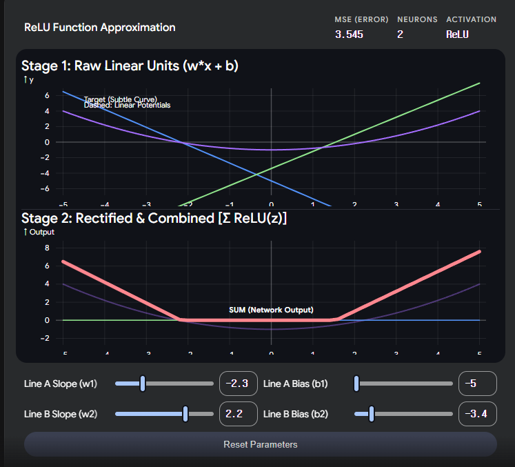
$$f(x) = \max(0, x)$$

음수는 0으로, 양수는 그대로 통과. 학습 파라미터는 없고 **비선형성만** 추가.

```
입력  -3.2  →  출력  0      (죽음)
입력  -0.1  →  출력  0      (죽음)
입력   0.5  →  출력  0.5   (통과)
입력   4.7  →  출력  4.7   (통과)
```

**왜 필요한가?** Linear만 쌓으면 아무리 깊어도 결국 직선 하나로 합쳐짐:
$$W_3(W_2(W_1 x)) = W_{합쳐진} \cdot x$$
ReLU가 중간에 음수를 꺾어야 **복잡한 비선형 경계** 학습 가능.
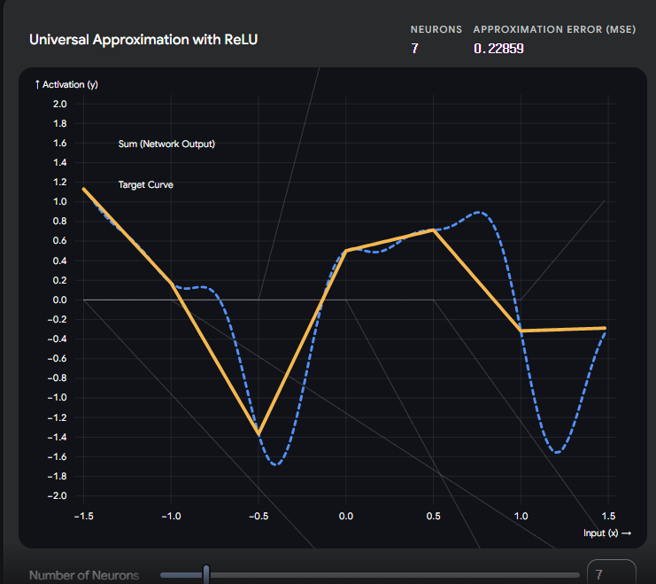

| | Linear만 | Linear + ReLU |
|--|--|--|
| 표현 경계 | 직선 1개 | 복잡한 곡선 |
| 학습 패턴 | 단순 비례 | 복합 조건 |

**`Linear → ReLU` 는 거의 세트** — Linear는 학습(O) 비선형(X), ReLU는 학습(X) 비선형(O).  
둘이 합쳐야 **학습 가능한 비선형 변환** 완성.  
은닉층 2에서 BatchNorm 없이 `Linear → ReLU`만 쓴 것도 같은 원리.

```
Linear  →  값을 섞고 조합  (학습O, 비선형X)
ReLU    →  음수를 꺾어 비선형 추가  (학습X, 비선형O)
합치면  →  학습O + 비선형O  ✅
```

> **입력에 음수가 들어오는 이유** — 원본 특징(FFT 크기값 등)은 전부 양수지만, Linear 통과 후 음수가 생김.  
> 가중치 $w$와 편향 $b$가 음수일 수 있기 때문:
> ```
> 원본:   peak_freq=5.2, rms=0.8  (전부 양수)
> Linear: y₀ = (+0.3)(5.2) + (-2.1)(0.8) + ... = -0.6  ← 음수 등장
>         y₁ = (-0.1)(5.2) + (+1.5)(0.8) + ... = +1.2
> ```
> 음수의 의미 = **패턴 감지기의 켜짐/꺼짐**:
>
> | 출력값 | 의미 | ReLU 후 |
> |--------|------|---------|
> | **양수** | 이 패턴이 감지됨 → 신호 전달 | 그대로 통과 |
> | **음수** | 이 패턴이 감지 안 됨 → 신호 없음 | 0으로 차단 |
>
> BatchNorm이 평균을 0으로 맞추는 이유도 여기 있음 — 절반 양수(켜짐)/절반 음수(꺼짐) 균형이 다양한 패턴 구분에 유리.

> **왜 양수/음수가 "패턴 감지 여부"인가?** — 학습이 $w$를 그렇게 만들기 때문.
>
> 학습 전엔 $w$가 랜덤이라 양수/음수에 아무 의미 없음.  
> 학습이 반복되면서 역전파가 $w$를 조정해서 **사람 패턴이 들어오면 양수, 배경이 들어오면 음수**가 되도록 수렴함.
>
> 수학적으로 $y = w \cdot x$ 는 **내적(dot product)** = $w$ 벡터와 $x$ 벡터의 방향이 얼마나 비슷한가:
> ```
> 학습 후 w = [+3.0, -1.0, +2.0]  ← "이 조합 = 사람"으로 수렴
>
> 사람 입력  x = [+2.5, -0.8, +1.9]  →  y = 7.5 + 0.8 + 3.8 = +12.1  ✅ 양수 (감지됨)
> 배경 입력  x = [-0.1, +3.2, -0.5]  →  y = -0.3 - 3.2 - 1.0 = -4.5  ❌ 음수 (감지 안 됨)
> ```
> $w$와 $x$의 방향이 **같으면** 양수, **반대면** 음수 → 학습이 끝나면 $w$ 자체가 "패턴 템플릿"이 됨.

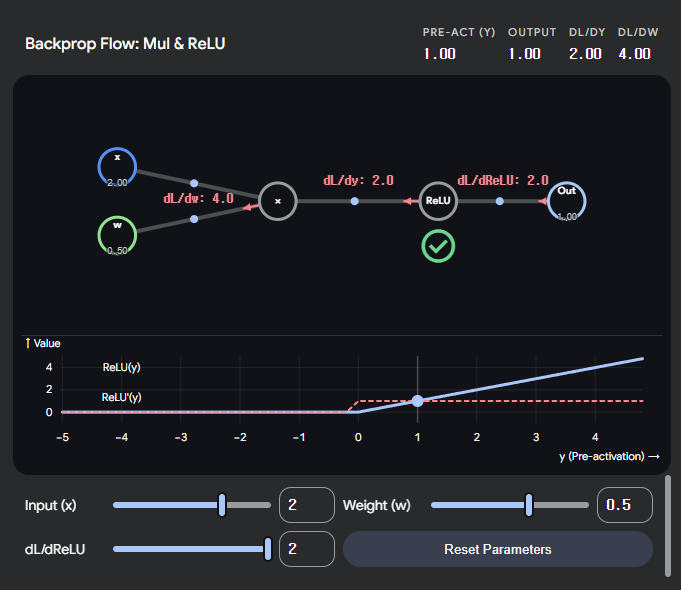

> **학습 단계에서 ReLU의 역할은?** — 역전파 경로 선택기.
>
> 추론 시: 음수 → 0 차단 (비선형성)  
> 학습 시: 역전파에서도 **활성화된 뉴런만 기울기를 앞으로 전달**하고, 꺼진 뉴런은 기울기를 0으로 막음.
>
> ReLU의 미분:
> $$\frac{d}{dx}\text{ReLU}(x) = \begin{cases} 1 & (x > 0) \\ 0 & (x \leq 0) \end{cases}$$
>
> ```
> 순전파:  x = +2.1  → ReLU → 2.1   (켜짐)
> 역전파:  기울기 = 0.8 × 1 = 0.8   ← 그대로 전달 → 이 경로의 w 학습됨
>
> 순전파:  x = -0.5  → ReLU → 0     (꺼짐)
> 역전파:  기울기 = 0.8 × 0 = 0     ← 0 전달 → 이 경로의 w 학습 안 됨
> ```
>
> | 단계 | ReLU 역할 |
> |------|-----------|
> | 순전파 (추론/학습 공통) | 음수 차단 → 비선형성 추가 |
> | 역전파 (학습 시만) | 켜진 뉴런만 기울기 전달 → 활성화된 경로만 선택적으로 학습 |
>
> **결과**: 뉴런마다 "내가 반응하는 패턴"에 대해서만 $w$가 업데이트됨 → 각 뉴런이 서로 다른 패턴에 특화되도록 수렴.  
> sigmoid·tanh는 포화(saturation) 구간에서 미분이 0에 가까워져 기울기가 소실되지만,  
> ReLU는 양수 구간에서 미분이 항상 **1** → 기울기 소실이 상대적으로 적음.

> **ReLU의 미분은 w를 나타내는가?** — 아니요, 다른 개념.
>
> 역전파에서 최종적으로 원하는 건 $\frac{dL}{dw}$ — "이 가중치가 오차에 얼마나 기여했나".  
> 연쇄 법칙으로 분해하면:
>
> $$\frac{dL}{dw} = \underbrace{\frac{dL}{d\,\text{ReLU}}}_{\text{뒤에서 온 오차}} \times \underbrace{\frac{d\,\text{ReLU}}{dy}}_{\text{ReLU 미분}} \times \underbrace{\frac{dy}{dw}}_{\text{w 미분}}$$
>
> | 미분 | 의미 | 값 |
> |------|------|-----|
> | $\frac{d\,\text{ReLU}}{dy}$ | **게이트** — 신호를 통과시킬지 | 1 또는 0 |
> | $\frac{dy}{dw}$ | **w 조정량** — w를 얼마나 고칠지 | $x$ (이전 층 출력값) |
>
> ```
> y = w·x + b  →  ReLU(y)
>
> dy/dw     = x          ← "w를 1 올리면 y가 x만큼 변한다"
> dReLU/dy  = 1 또는 0   ← "y가 양수면 통과, 음수면 차단"
> ```
>
> ReLU가 0을 내보내면 전체 곱이 0 → 꺼진 뉴런의 $w$는 그 배치에서 업데이트 안 됨.  
> **ReLU 미분** = 오차 신호의 통로 역할 / **w 미분** = 실제 가중치 조정량. 둘 다 곱해야 최종 업데이트량이 나옴.
> 
> **오차의 출발지: 손실 함수 (Loss Function)**
> 모든 오차 흐름의 기원은 모델의 가장 마지막 단계인 손실 함수입니다.
> 순전파(Forward Pass): 데이터가 입력되어 가중치($w$)들과 계산을 거쳐 최종 예측값($\hat{y}$)이 나옵니다.
> 손실 계산: 이 예측값과 실제 정답($y$)을 비교합니다. (예: MSE, Cross-Entropy 등)
> 기울기 발생: 이때 발생한 오차값($L$)을 출력층 바로 직전의 노드로 미분하기 시작합니다. 
> 이것이 바로 **첫 번째 '상류 오차**가 됩니다.
>
> **오차가 전달되는 과정 (전달 체인)**
> 오차는 마치 릴레이 경주처럼 각 층을 거치며 전달됩니다. 
> $\frac{dL}{d,\text{ReLU}}$는 아래와 같은 긴 체인의 중간 단계입니다.
> $$\underbrace{\frac{dL}{d\hat{y}}}_{\text{손실함수 미분}} \rightarrow \underbrace{\frac{d\hat{y}}{dh_n}}_{\text{출력층 미분}} \rightarrow \dots \rightarrow \underbrace{\frac{dh_{i+1}}{d\,\text{ReLU}}}_{\text{다음 층의 미분}} \rightarrow \mathbf{\frac{dL}{d\,\text{ReLU}}}$$
> 즉, 내 현재 층($i$)보다 더 깊은 곳(출력층에 가까운 곳)에 있는 모든 층이 계산해온 결과물이 나에게 전달되는 것입니다.
>
> **시각적 흐름: 폭포수 효과**
> 오차 전달을 그래프로 시각화하면, 뒤에서 오는 오차는 **'나보다 뒤에 있는 모든 연산이 손실(Loss)에 미치는 영향력의 합'**이라고 볼 수 있습니다.
> 출력층 근처: 오차가 직접적으로 발생하므로 값이 명확합니다.
> 입력층 근처: 여러 층을 거치면서 오차가 곱해지거나(기울기 폭주), 너무 작아져서 사라지기도(기울기 소실) 합니다.


> **Linear도 레이어고 ReLU도 레이어인가?** — 맞음. 둘 다 레이어지만 종류가 다름.
>
> | 레이어 | 학습 파라미터 | 하는 일 |
> |--------|--------------|---------|
> | `nn.Linear` | ✅ $w$, $b$ 있음 | 값을 섞고 조합 (선형 변환) |
> | `nn.ReLU` | ❌ 없음 | 음수를 0으로 꺾음 (비선형성) |
> | `nn.BatchNorm1d` | ✅ $\gamma$, $\beta$ 있음 | 정규화 후 스케일/이동 조정 |
> | `nn.Dropout` | ❌ 없음 | 랜덤으로 뉴런 꺼버림 |
>
> PyTorch에서 `nn.Module`을 상속하면 전부 "레이어"라 부름.  
> 구분하자면:
> - **파라미터 레이어**: 학습으로 $w$가 업데이트됨 (Linear, BatchNorm 등)
> - **함수 레이어**: 파라미터 없이 변환만 함 (ReLU, Dropout 등)
>
> ```python
> self.net = nn.Sequential(
>     nn.Linear(24, 64),    # 파라미터 레이어
>     nn.BatchNorm1d(64),   # 파라미터 레이어
>     nn.ReLU(),            # 함수 레이어
>     nn.Dropout(0.3),      # 함수 레이어
> )
> ```
> 전부 `.forward()` 에서 순서대로 통과하고, 역전파도 역순으로 통과함.

> **$y = ax + b$ 가 가중치인가?** — 맞음, 완전히 동일.
> ```
> 수학 직선:  y = a·x + b
> 뉴런 1개:   y = w·x + b   ← 같은 식
> ```
> 뉴런 1개 = 직선 1개를 긋는 것. 입력 24개 → 24차원 공간에서 직선(초평면).  
> 직선 1개로는 복잡한 데이터를 나눌 수 없음 → **뉴런 64개 = 직선 64개**를 동시에 그어서 ReLU로 조합하면 꺾인 복잡한 경계 생성.  
> **학습 = 직선들의 기울기(w)와 절편(b)를 조정하는 것.** 처음엔 랜덤, 반복할수록 사람/배경을 가장 잘 나누는 방향으로 수렴.

> **ReLU의 임계값 0은 고정인가? 변형은 없는가?** — 표준 ReLU의 0은 고정이지만, 변형 버전이 존재함.
>
> 표준 ReLU는 $f(x) = \max(0, x)$ — 임계값 0은 학습되지 않고 변하지 않음.  
> 하지만 "음수를 완전히 죽이는 것"의 단점을 보완한 변형들이 있음:
>
> | 함수 | 음수 처리 | 특징 |
> |------|-----------|------|
> | **ReLU** | $\max(0,\ x)$ → 완전히 0 | 간단·빠름, 학습 파라미터 없음 |
> | **Leaky ReLU** | $\max(0.01x,\ x)$ → 아주 작은 기울기 유지 | 음수도 약하게 통과, 0.01은 고정값 |
> | **PReLU** | $\max(\alpha x,\ x)$ → $\alpha$ 는 **학습됨** | 기울기를 역전파로 직접 학습 |
> | **ELU** | $x < 0$ 이면 $e^x - 1$ | 부드러운 곡선으로 음수 처리 |
> | **GELU** | 확률 기반으로 부드럽게 억제 | Transformer(BERT, GPT)에서 주로 사용 |
>
> 
> 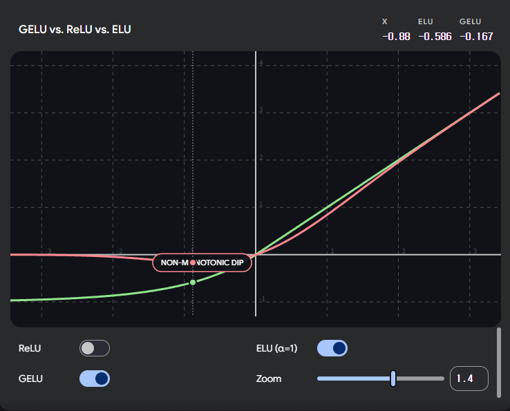
> **왜 ReLU가 기본으로 쓰이는가?**
> - 계산이 단순 ($\max$ 연산 하나)
> - 양수 구간에서 미분이 항상 **1** → 깊은 네트워크에서 기울기 소실 문제 없음
> - 음수를 완전히 끊어 **희소성(sparsity)** 생성 → 과적합 억제에 유리
>
> **단점 — Dying ReLU 문제:**  
> 음수 뉴런이 완전히 죽으면 이후 역전파 기울기도 0 → 해당 뉴런의 $w$가 영원히 업데이트 안 됨.  
> 이 문제를 해결하기 위해 Leaky ReLU / PReLU가 나온 것.

---
### 🔶 `Dropout(0.3)` — 과적합 방지

학습 중 뉴런을 **랜덤으로 30% 꺼버리는** 기법.

**과적합(Overfitting)** = 모델이 학습 데이터를 너무 외워서 새 데이터에 틀리는 현상:
```
과적합:  "샘플 3번은 peak_freq=5.2, rms=0.8 → 사람"  → 5.3이면 모름 ❌
정 상:   "저주파 에너지가 전반적으로 높으면 사람"      → 새 데이터에도 동작 ✅
```

특정 뉴런에 **의존하지 못하게** 강제 → 모든 뉴런이 독립적으로 패턴 학습:
```
배치 1:  뉴런 [3, 7, 15, 42, ...] 꺼짐 → 나머지로 학습
배치 2:  뉴런 [1, 9, 28, 61, ...] 꺼짐 → 나머지로 학습
배치 3:  뉴런 [5, 12, 33, 55, ...] 꺼짐 → 나머지로 학습
```

| | Dropout 없음 | Dropout 30% |
|--|--|--|
| 학습 데이터 정확도 | 매우 높음 (외움) | 조금 낮음 |
| 새 데이터 정확도 | 낮음 ❌ | 높음 ✅ |
| 뉴런 의존성 | 특정 뉴런에 의존 | 고루 분산 |

> **추론(예측) 시에는 Dropout이 꺼짐.** `model.eval()` 호출 시 모든 뉴런이 켜진 채로 동작.  
> 코드에서 `_predict()`에 `model.eval()`이 있는 이유가 바로 이것.

---
### 🔶 두 번째 은닉층에 BatchNorm이 없는 이유

**① 1층에서 이미 정규화 완료** — 2층 입력은 이미 안정적인 범위. 중복 불필요.  
**② 출력층에 가까울수록 BatchNorm이 해로울 수 있음** — 출력에 가까운 층일수록 "패턴이 얼마나 강한가"라는 크기 정보가 중요. BatchNorm이 크기를 평균 0으로 눌러버리면 분류 성능 저하 가능.

---
### 🔶 레이어를 더 많이 쌓으면 안 좋은가?

무조건 나쁘진 않지만 **데이터 양과 균형**이 필요.

| 레이어 수 | 장점 | 단점 |
|-----------|------|------|
| 너무 적음 (1개) | 빠르고 단순 | 복잡한 패턴 못 배움 |
| 적당 (2~3개) ✅ | 균형 | — |
| 너무 많음 (5개+) | 복잡한 패턴 가능 | 데이터 부족하면 과적합, 기울기 소실 |

**역전파(Backpropagation)** = 예측이 틀렸을 때 오차를 **뒤→앞 방향**으로 전달해 가중치를 수정하는 과정:
```
순전파:  입력 → 층1 → 층2 → 출력 → 오차 계산
역전파:  오차 → 층2 수정 → 층1 수정 → (앞쪽으로 거슬러 올라감)
```

**기울기 소실(Vanishing Gradient)** = 역전파 시 오차 신호가 층을 거슬러 올라가며 곱하기를 반복해 **점점 0에 수렴**하는 현상:
```
층 5 기울기: 0.5
층 4 기울기: 0.5 × 0.5 = 0.25
층 3 기울기: 0.25 × 0.5 = 0.125
층 2 기울기: 0.125 × 0.5 = 0.06  ← 거의 학습 안 됨
층 1 기울기: 0.06  × 0.5 = 0.03  ← 사실상 정지
```

> **왜 층마다 곱셈이 되는가?** — 연쇄 법칙(Chain Rule) 때문. 오차가 층을 거슬러 올라갈 때 각 층의 기울기를 **곱해가며** 전달.  
> 귓속말 게임 비유: 각 층이 신호를 100% 전달 못하고 걸러내기 때문에 곱셈이 됨.
>
> 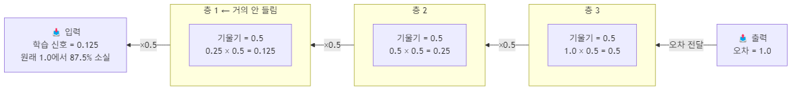
``<!-- source: images/diagram_03.mmd -->``
>
> ReLU가 음수를 0으로 죽이므로 역전파 시 죽은 뉴런은 기울기를 **0으로 막음** → 살아있는 뉴런만 신호 전달 → 층마다 신호 감소.  
> 수식으로는 층들이 연쇄적으로 곱해짐:
> $$\frac{\partial L}{\partial w_1} = \frac{\partial L}{\partial y_3} \times \frac{\partial y_3}{\partial y_2} \times \frac{\partial y_2}{\partial y_1} \times \frac{\partial y_1}{\partial w_1}$$
> 중간에 작은 값이 하나라도 있으면 앞쪽 층 기울기는 극도로 작아짐.
> 

> **왜 기울기를 곱하는가?** — 합성 함수 미분(연쇄 법칙) 때문.  
> 층이 2개면 전체 함수는 $\text{출력} = f_2(f_1(x))$. $w_1$이 출력에 미치는 영향:
> $$\frac{d\,출력}{d\,w_1} = \underbrace{\frac{d\,출력}{d\,f_1}}_{\text{층2 민감도}} \times \underbrace{\frac{d\,f_1}{d\,w_1}}_{\text{층1 민감도}}$$
> 공장 비유: "부품 크기를 1mm 바꾸면 완성품이 얼마나 바뀌나?"  
> = (조립공장 민감도) × (부품공장 민감도) → 곱셈이 될 수밖에 없음.
>
> 수식에서 **입력**과 **민감도**가 각각 무엇인지:
> ```
> x(입력) → [층1: f₁ = w₁·x + b] → [층2] → Loss(출력)
> ```
>
> | 항목 | 수식 | 값 | 의미 |
> |------|------|----|------|
> | **입력** | $x$ | 원본 데이터 | 층1에 들어오는 값 |
> | **층1 민감도** | $\frac{d\,f_1}{d\,w_1}$ | $= x$ | "w₁을 바꾸면 층1 출력이 얼마나 변하는가" |
> | **층2 민감도** | $\frac{d\,\text{출력}}{d\,f_1}$ | 뒤에서 전달됨 | "f₁이 바뀌면 Loss가 얼마나 변하는가" |
>
> 층1 민감도 = $\frac{d\,f_1}{d\,w_1}$ 에서 $f_1 = w_1 \cdot x + b$ 를 $w_1$으로 미분하면 → **$x$** (입력값 자체).
>
> 즉 전체 수식의 의미:
> $$\frac{d\,\text{Loss}}{d\,w_1} = \underbrace{\frac{d\,\text{출력}}{d\,f_1}}_{\text{뒤에서 온 오차}} \times \underbrace{\frac{d\,f_1}{d\,w_1}}_{= x \text{ (입력값)}}$$
> **"뒤에서 온 오차" × "입력값 x"** = $w_1$ 조정량.  
> 층1 민감도는 항상 **그 층에 들어온 입력값 $x$** 가 됨.

> **오차 = 1.0 은 어디서 나오는가?** — 설명용 예시값. 실제 오차는 **손실 함수(Loss)** 에서 나옴.  
> 우리 코드는 `CrossEntropyLoss` = $-\log(\text{정답 클래스 확률})$ 사용:
> ```
> 정답: HUMAN [0, 1]
> 예측: [0.8, 0.2]  (80% 배경, 20% 사람)  →  Loss = -log(0.2) ≈ 1.61  ← 크게 틀림
> 예측: [0.1, 0.9]  (10% 배경, 90% 사람)  →  Loss = -log(0.9) ≈ 0.10  ← 거의 맞음
> ```
> 역전파는 이 Loss의 미분값을 시작점으로 삼음. `1.0`은 단순화한 숫자.

> **$-\log(x)$ 그래프** — 틀릴수록 오차가 **급격히** 커지는 구조:
>
> 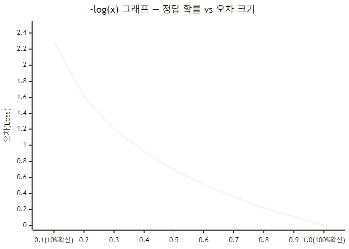
``<!-- source: images/diagram_04.mmd -->``
>
> | 정답 확률 | Loss | 의미 |
> |-----------|------|------|
> | 1.0 | **0.00** | 완벽히 맞힘 → 오차 없음 |
> | 0.5 | **0.69** | 반반으로 찍음 |
> | 0.1 | **2.30** | 완전히 틀림 → 오차 폭발 |
>
> 조금 틀렸을 때보다 완전히 틀렸을 때 훨씬 강하게 페널티를 주는 구조.

> **미분이란?** = "이 값을 아주 조금 바꿨을 때 결과가 얼마나 변하는가" → **변화율**.  
> 속도계 비유: 위치를 시간으로 미분 = 속도 / 속도를 시간으로 미분 = 가속도.
>
> 딥러닝에서는 가중치 $w$를 아주 조금 바꿨을 때 Loss가 얼마나 변하는지:
> $$\frac{dL}{dw} = \frac{L(w+\epsilon) - L(w)}{\epsilon}$$
> ```
> w = 0.5  → Loss = 2.3
> w = 0.51 → Loss = 2.1
> 미분값 = (2.1 - 2.3) / 0.01 = -20
> 의미: "w를 0.01 올리면 Loss가 0.2 줄어든다" → w를 올리는 방향이 맞다!
> ```
>
> 미분값의 부호가 핵심:
>
> | 미분값 | 의미 | 가중치 조정 |
> |--------|------|------------|
> | **양수** | w 올리면 Loss도 올라감 | w를 **내려야** 함 |
> | **음수** | w 올리면 Loss가 내려감 | w를 **올려야** 함 |
> | **0** | w 바꿔도 Loss 변화 없음 | 최적점 도달 |
>
> 학습 = 미분값 보고 Loss가 줄어드는 방향으로 $w$ 조금씩 조정 → **경사하강법(Gradient Descent)**:
> $$w_{새} = w_{현재} - \underbrace{\alpha}_{\text{학습률(LR=1e-3)}} \times \underbrace{\frac{dL}{dw}}_{\text{미분값}}$$
>
> 시각화 — **Loss 곡선**: w=0 이 최적점(바닥), 미분값 = 현재 위치의 경사 기울기:
>
> 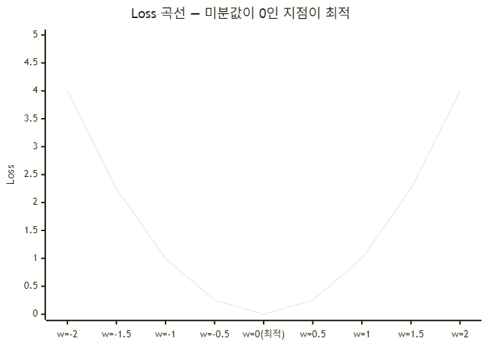
``<!-- source: images/diagram_05.mmd -->``
>
> 시각화 — **경사하강법**: 미분값 부호에 따라 w가 최적점으로 수렴:
>
> 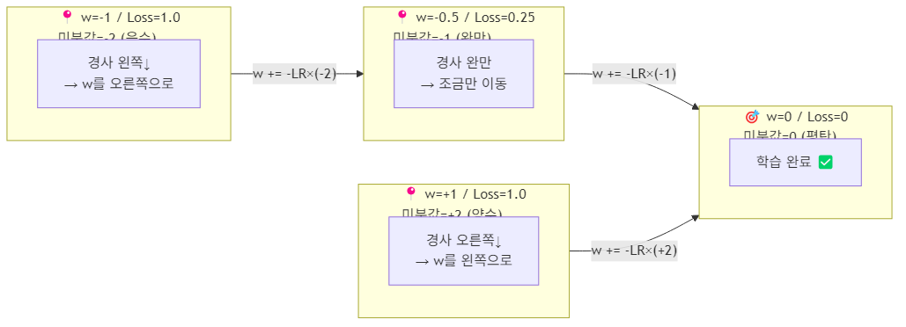
``<!-- source: images/diagram_06.mmd -->``
>
> 산 비유: 미분값 = 지금 서 있는 곳의 경사 각도. 학습 = 경사 반대 방향으로 한 걸음씩 내려가기.

> **미분과 적분 쉽게 이해하기**
>
> **🔻 미분 = 순간 기울기** — "지금 이 순간 얼마나 빠르게 변하는가?"  
> 곡선 위 한 점에서 접선을 그었을 때의 기울기. 결과 = 숫자 하나(기울기값).
> ```
> 자동차 위치:  0초=0km / 1초=0.02km / 2초=0.08km / 3초=0.18km
> 2초에서 미분 = (0.18-0.08)/1 = 0.1 km/s = 360 km/h  ← 순간 속도
> ```
>
> **🔺 적분 = 누적 넓이** — "여기까지 얼마나 쌓였는가?"  
> 곡선 아래 넓이를 잘게 쪼개서 더함. 결과 = 누적된 양.
> ```
> 속도 60km/h 로 2시간 이동
> → 넓이 = 60 × 2 = 120km  (이동 거리)
> 속도가 변해도 잘게 쪼개서 더하면 정확한 거리 계산 가능
> ```
>
> 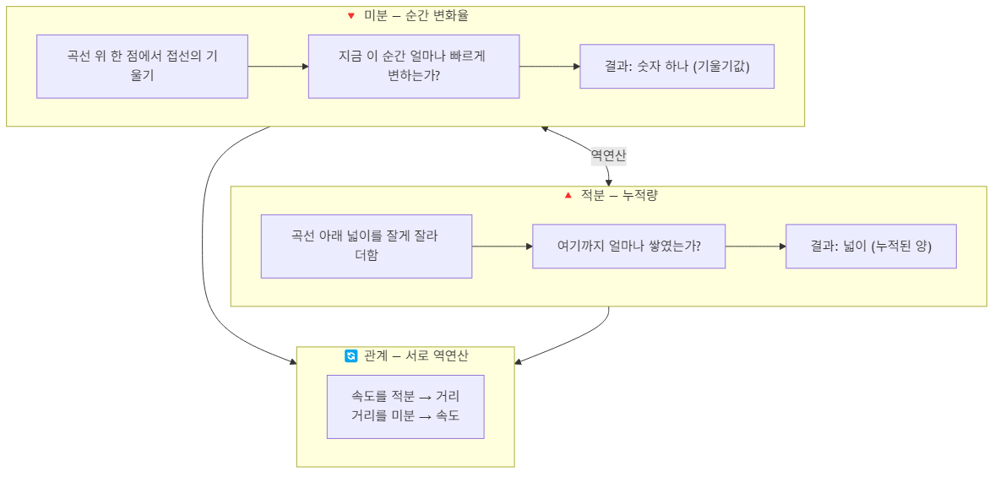
``<!-- source: images/diagram_07.mmd -->``
>
> | | 미분 | 적분 |
> |--|------|------|
> | 질문 | 지금 얼마나 빠른가? | 지금까지 얼마나 갔는가? |
> | 입력 | 위치 곡선 | 속도 곡선 |
> | 출력 | 속도 (순간값) | 거리 (누적값) |
> | 연산 | 쪼개기 | 합치기 |
>
> $$\text{위치} \xrightarrow{\text{미분}} \text{속도} \xrightarrow{\text{미분}} \text{가속도}$$
> $$\text{가속도} \xrightarrow{\text{적분}} \text{속도} \xrightarrow{\text{적분}} \text{위치}$$
>
> **딥러닝에서는 적분은 거의 안 씀.** 역전파에서 미분만 집중적으로 사용.

> **층 3의 기울기는 어떻게 구하는가?**  
> 층 3 연산: $y_3 = \text{ReLU}(w_3 \cdot y_2 + b_3)$  
> "$w_3$을 아주 조금 바꾸면 $y_3$이 얼마나 변하는가?" = 층 3의 기울기.
> ```
> w3 = 0.5  → y3 = ReLU(0.5 × 2.0) = 1.0
> w3 = 0.51 → y3 = ReLU(0.51× 2.0) = 1.02
> 층3 기울기 = (1.02 - 1.0) / 0.01 = 2.0  ← y2 값 자체!
> ```
> $y = w \cdot x$ 를 $w$로 미분하면 $x$ → **층 3의 기울기 = 이전 층 출력값 $y_2$**

> **왜 오차에 기울기를 곱하는가?**  
> 오차만 알면 "어떤 가중치를 얼마나 고쳐야 하는지" 모름.  
> 기울기만 알면 "얼마나 틀렸는지" 모름.  
> **곱해야 "이 가중치가 이 오차에 얼마나 기여했는가"** 를 알 수 있음.
>
> 온도조절기 비유:
> ```
> 오차   = "방이 5도 너무 차다"          ← 얼마나 틀렸나
> 기울기 = "다이얼 1칸 = 온도 2도 변화"  ← 이 가중치의 영향력
> 곱셈   = 5 ÷ 2 = 2.5칸 돌려야 함       ← 조정량
> ```
>
> | 오차 | 기울기 | 조정량 | 이유 |
> |------|--------|--------|------|
> | 크다 | 크다 | **많이** | 이 가중치가 주범 |
> | 크다 | 0에 가까움 | **거의 안** | 이 가중치는 무관 |
> | 작다 | 크다 | **조금만** | 이미 거의 맞음 |
>
> ```
> dL/dw3 = (오차가 y3에 미치는 민감도) × (y3가 w3에 미치는 민감도)
>         = 1.0 (오차)                 × 2.0 (기울기)
>         = 2.0  ← w3을 이만큼 조정
> ```

---

> **미분 = 변화율 = 기울기 — 셋 다 같은 말**
>
> | 용어 | 뜻 |
> |------|-----|
> | 미분 | x가 조금 변할 때 y가 얼마나 변하는가 |
> | 변화율 | 위와 동일 |
> | 기울기(경사) | 그래프 접선의 기울기 = 위와 동일 |
> | **gradient** | 다차원에서 기울기의 일반화 (딥러닝 용어) |
>
> 딥러닝에서 "기울기를 구한다" = "미분한다" = "변화율을 구한다" — 전부 같은 말.
>
> **입문 단계에서 "미분 = 기울기"로 이해하는 것 맞음.** 정확히는:
> ```
> y = x²  →  미분 = 2x  (각 x 위치에서의 기울기)
>
> x=1  일 때: 기울기 =  2   (오른쪽으로 가파름)
> x=0  일 때: 기울기 =  0   (평탄 = 최솟값)
> x=-1 일 때: 기울기 = -2   (왼쪽으로 가파름)
> ```
> 딥러닝에서도 "Loss 곡선에서 현재 $w$ 위치의 기울기"를 구하는 것이 미분.  
> $w$가 수천 개일 때는 "각 방향으로의 기울기 벡터" = **gradient** 라고 부름. 1차원에서 기울기 = gradient 는 같은 개념.

> **미분은 역전파인가?** — 아니요. 미분은 역전파의 핵심 **도구**이고, 역전파는 미분을 **활용하는 과정**.
>
> | 개념 | 역할 |
> |------|------|
> | **미분** | $w$를 조금 바꿨을 때 Loss가 얼마나 변하는가 → 숫자 계산 방법 |
> | **역전파** | 모든 $w$에 대해 미분을 효율적으로 계산하는 알고리즘 |
>
> 비유: 미분 = 나침반 / 역전파 = 나침반을 들고 산을 내려오는 행동
> ```
> 역전파 과정:
> 1. 순전파 → Loss 계산
> 2. Loss를 출력층 w에 대해 미분  ← 미분 사용
> 3. 연쇄 법칙으로 앞층 w에 대해 미분  ← 미분 사용
> 4. 모든 w에 대한 미분값(gradient) 계산 완료
> 5. optimizer.step() → w -= lr × gradient  ← w 업데이트
> ```
> 역전파는 "미분을 층마다 연쇄적으로 적용하는 알고리즘"이라고 이해하면 정확함.

> **역전파 방향과 미분 — "y로 w 기울기를 수정하는 것인가?"**
>
> 맞음. 정확한 이해.
>
> $$\text{순전파:} \quad x \xrightarrow{y = wx+b} y \xrightarrow{} \text{Loss}$$
> $$\text{역전파:} \quad \text{Loss} \xrightarrow{\frac{dL}{dy}} y \xrightarrow{\frac{dy}{dw}=x} w \text{ 수정}$$
>
> ```
> 순전파: w, x가 주어져 있고 → y = wx + b 계산 → 앞으로 전달
> 역전파: 출력에서 오차 발생 → "w를 어떻게 고쳐야 하나?" → 미분으로 거꾸로 계산
>
> 구체적으로:
>   1. Loss에서 y에 미치는 영향  =  dL/dy  (뒤 층에서 전달됨)
>   2. y에서 w에 미치는 영향    =  dy/dw = x  (y = wx+b 를 w로 미분)
>   3. 둘을 곱하면: dL/dw = dL/dy × x  → 이걸로 w 수정
> ```
>
> **"역방향으로 가기 위해 미분을 쓴다"** — 정확한 이해.  
> 미분이 "이 층에서 w가 출력에 얼마나 영향을 주는가"를 계산해주고,  
> 그걸 연쇄로 곱하면 출력→앞쪽 방향으로 각 w의 책임을 거슬러 올라갈 수 있음.

> **`dy/dw = x` 인 이유**
>
> $y = wx + b$ 를 **$w$에 대해** 미분하는 것.  
> $w$를 변수로 보고, $x$와 $b$는 상수로 취급:
> $$\frac{dy}{dw} = \frac{d(wx)}{dw} + \frac{d(b)}{dw} = x + 0 = x$$
>
> 직관적으로:
> ```
> x = 3 으로 고정, w만 바꿔가며 관찰:
>
> w = 1  →  y = 1×3 + b = 3
> w = 2  →  y = 2×3 + b = 6
> w = 3  →  y = 3×3 + b = 9
>
> w가 1 오를 때마다 y는 3씩 오름  →  dy/dw = 3 = x
> ```
>
> **"w를 1 올리면 y가 x만큼 변한다"** — 그래서 dy/dw = x.
>
> | x 값 | dy/dw | 의미 |
> |------|--------|------|
> | x = 5.0 | 5.0 | w를 1 올리면 y가 5.0 변함 → w 영향 큼 |
> | x = 0.1 | 0.1 | w를 1 올려도 y가 0.1만 변함 → w 영향 작음 |
> | x = 0   | 0   | w를 아무리 바꿔도 y 변화 없음 → 이 w는 학습 안 됨 |
>
> 결국 **이전 층 출력값 $x$가 클수록, 그 연결의 $w$가 오차에 더 많이 기여한 것** → 더 많이 수정됨.

> **ReLU 역전파에서 음수 문제 — Dying ReLU**
>
> 순전파: 음수 입력 → 0 출력 (맞음)  
> ReLU를 미분하면:
> ```
> d/dx ReLU(x) = 1  (x > 0)
>              = 0  (x ≤ 0)
> ```
> ```
> 순전파  x = -2.0 → ReLU → 출력: 0
> 역전파  기울기 = 0 → 오차 신호가 0 전달 → 가중치 업데이트 없음
> ```
> 입력이 음수였던 뉴런은 **역전파 기울기가 0** → 학습을 하지 않음.  
> 이를 **죽은 뉴런(Dying ReLU)** 문제라 함.
>
> → **BatchNorm을 ReLU 앞에 두는 이유**: 입력을 정규화해서 음수가 너무 많이 들어오지 않도록 막아줌.

---

**데이터 양 vs 권장 은닉층 수:**

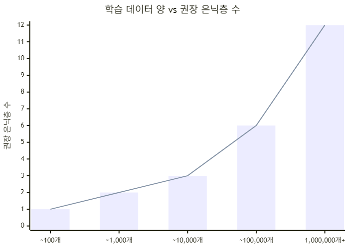
``<!-- source: images/diagram_08.mmd -->``

| 데이터 양 | 권장 은닉층 | 비고 |
|-----------|------------|------|
| ~100개 | **1개** | SVM이 더 나을 수도 있음 |
| ~1,000개 | **2개** ← 우리 프로젝트 | MLP 2층이 적합 |
| ~10,000개 | **3개** | CNN 고려 |
| ~100,000개 | **5~6개** | CNN 본격 활용 |
| 1,000,000개+ | **10개+** | ResNet, Transformer 등 |

---

## 1D-CNN

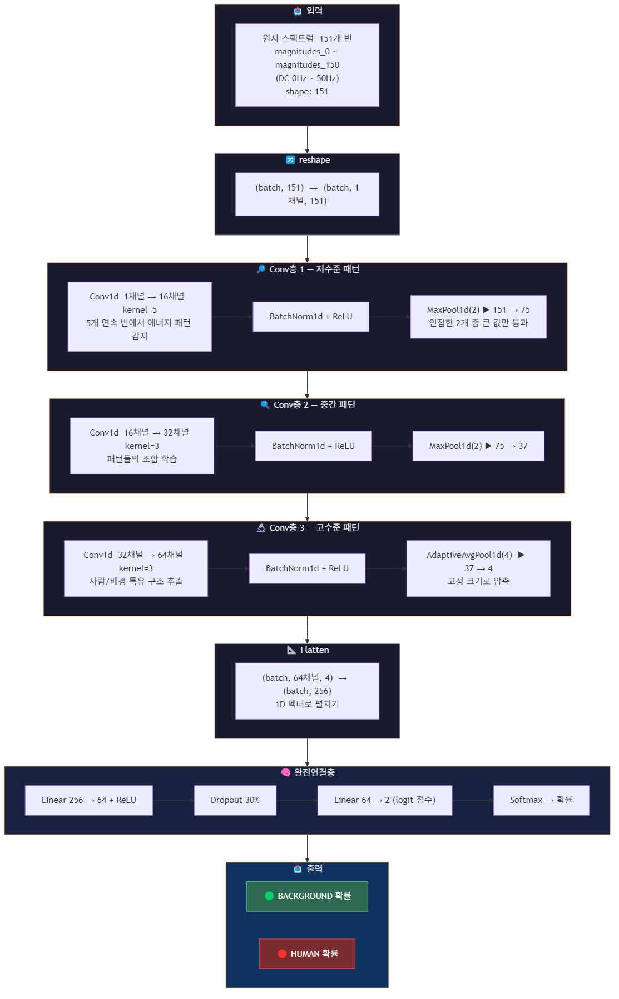
``<!-- source: images/diagram_09.mmd -->``

---

## 비교 요약

| 항목 | MLP | 1D-CNN |
|------|-----|--------|
| 입력 | 24개 선택 특징 | 원시 스펙트럼 151개 |
| 특징 추출 | 사람이 직접 설계 | 모델이 자동 학습 |
| 파라미터 수 | ~2,400개 (가벼움) | ~40,000개 (더 강력) |
| 데이터 요구량 | 적어도 됨 | 많을수록 유리 |
| 권장 상황 | 데이터 적을 때 | 데이터 충분할 때 |

---

## Transformer — PIR 센서에 적절한가?

**결론: 현재 상황에서는 적절하지 않음.**

### 모델별 최소 데이터 요구량

| 모델 | 현실적 최소 샘플 수 | 현재 (124개) | 판단 |
|------|------------------|-------------|------|
| **SVM** | ~50개 | ✅ | 가장 적합 |
| **MLP** | ~500개 | ⚠️ | 아슬아슬 (과적합 위험) |
| **1D-CNN** | ~1,000개 | ❌ | 데이터 부족 |
| **Transformer** | ~10,000개 이상 | ❌❌ | 완전히 부적합 |

### Transformer가 부적합한 이유

**① 파라미터 수가 데이터보다 많음**
```
Transformer (tiny 버전조차):
  Attention: 151 × 151 = 22,801개 가중치 (FFT 151빈 기준)
  + FFN, 임베딩 등 합치면 수만 개

현재 데이터: 124개
→ 파라미터 > 데이터 → 무조건 과적합, 학습 자체가 의미 없음
```

**② 입력 구조가 Transformer에 맞지 않음**

Transformer는 **순서가 있는 긴 시퀀스의 장거리 의존성**을 잡는 게 핵심.

```
NLP:  [토큰1, 토큰2, ... 토큰512]  ← 앞 단어가 뒤 단어에 영향
FFT:  [bin0,  bin1,  ... bin150 ]  ← 인접 bin이 중요, 장거리 의존성 없음
```

PIR FFT 스펙트럼은 **인접한 주파수 빈끼리** 상관관계가 있지, 저주파(bin 1)가 고주파(bin 150)와 직접 의존하지 않음. → CNN의 **로컬 필터**가 더 자연스럽게 처리.

**③ Transformer가 의미 있는 케이스는 "시간 시퀀스"일 때**

```
현재:  [단일 FFT 스냅샷 1개] → 분류  (시퀀스 아님)

Transformer가 맞는 경우:
  [FFT_t0]
  [FFT_t1]  →  사람/배경
  [FFT_t2]
  ...
  [FFT_t19]   ← 이게 샘플 1개 (연속 20프레임 묶음)
```

### 샘플 1개의 정의 차이

**현재 MLP/CNN 방식:**
```
샘플 1개 = 시간 t에서 찍은 FFT 스냅샷 1장
           [bin0, bin1, ... bin150]  →  사람/배경

현재 124개 = 124번 측정한 스냅샷 124장
```

**Transformer 방식 (시퀀스 입력):**
```
샘플 1개 = 연속된 N개 시간 프레임을 묶은 시퀀스
           [FFT_t0, FFT_t1, ... FFT_t19]  →  사람/배경

10,000개 필요 = 이 시퀀스 묶음이 10,000세트
             = 10,000 × 20프레임 = 200,000회 측정 필요  ❌
```

### Transformer가 유리한 상황

PIR 특성상 **시간 흐름에 따른 패턴**이 분류에 중요할 때 의미 있음:

```
사람 패턴:   t0: 큰 신호 → t1: 중간 → t2: 작은 신호 → "사람 있음"
배경 패턴:   t0: 작은  → t1: 작은  → t2: 작은       → "배경"
```

스냅샷 한 장으로도 충분히 구분된다면 CNN이 훨씬 효율적.

### 현실적 권장 순서

```
현재  (124개)    →  SVM ✅  (MLP 시도 가능, CNN은 보류)
데이터 500개+   →  MLP
데이터 1,000개+ →  1D-CNN
데이터 10,000개+ →  Transformer 고려 가능 (단, 시퀀스 구조일 때만)
```
