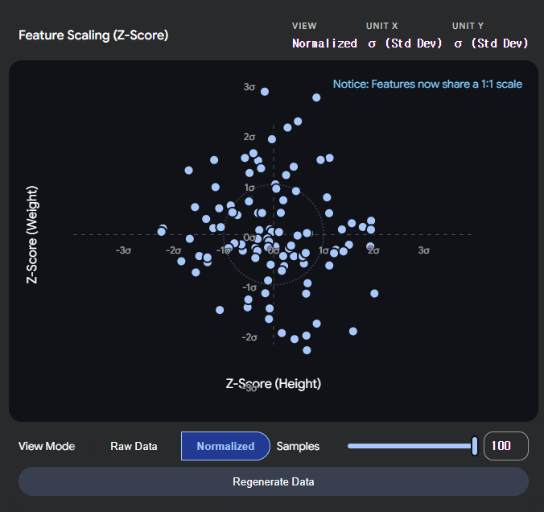
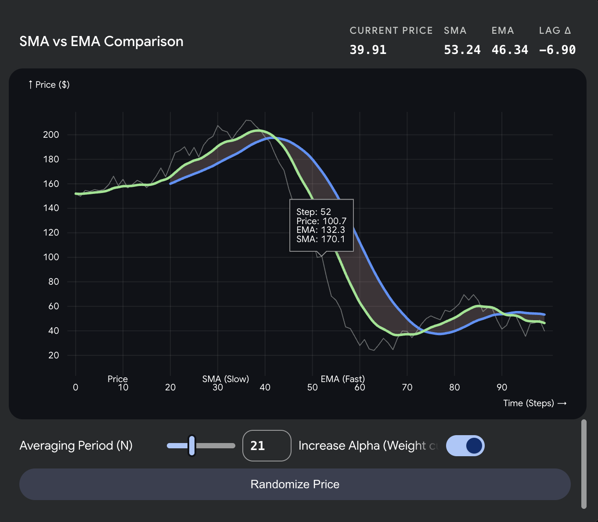
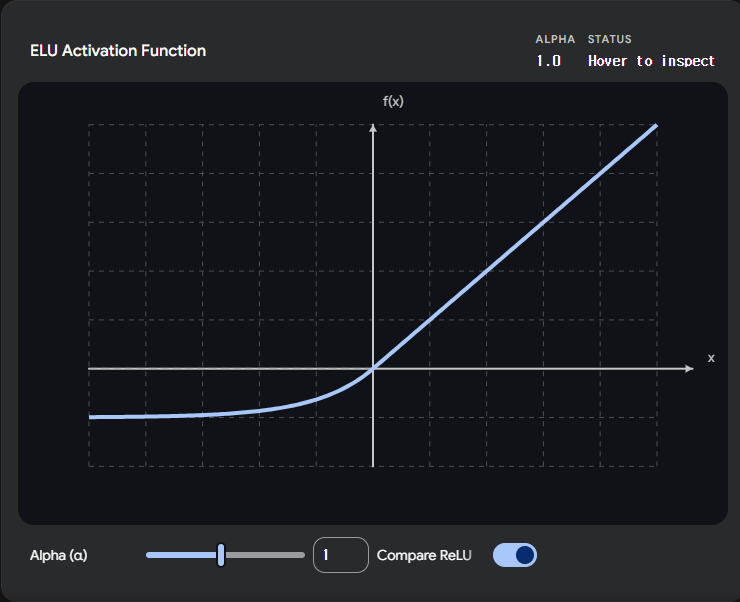

---

# ☑️ 학습(Training)과 추론(Inference)

## ✔️ 학습 vs 추론 차이점
|단계|순전파|역전파|
|-|-|-|
|**학습(Training)**|✅|✅|
|**추론(Inference)**|✅|❌|

## ⏳ 진행 과정
**학습(Training)** : 순전파 → 확률 출력 → *Loss(오차율) 계산 → 역전파(*미분) → w(가중치) 업데이트 → 반복
**추론(Inference)** : 순전파 → 확률 출력
*Loss(오차율) : 
*미분 : 

## 📜 python 코드
```python
# 학습 시
loss = criterion(output, label) 
loss.backward()                 # ← 역전파 실행
optimizer.step()                # ← w 업데이트
# 추론 시
with torch.no_grad():           # ← 역전파 그래프 생성 비활성화 (메모리/속도 절약)
    output = model(x)
```
- `torch.no_grad()` : 역전파 그래프 생성 비활성화
→ **학습 시**, `PyTorch`가 역전파를 위해 중간 계산값을 전부 메모리에 보관 
→ **추론 시**, 그럴 필요가 없음

---

# ☑️ Neural Network 구조

## ✔️ **뉴런(Neuron) 기본 구조**
``` text
진행 방향 →
              /       [🔵]
  [⚫️]        ㅡ      [🔵]
              \       [🔵]
    ↑         ↑         ↑
  start     weight     end
(시작 뉴런) (가중치)  (끝 뉴런)
```
✅ **뉴런(Neuron)** == **노드(Node)** == **유닛(Unit)**

## 📜 python 코드
```python
import torch.nn as nn

nn.Linear(24, 64)
          ↑    ↑
  in_features   out_features
 (이전 층 크기)  (다음 층 크기)
```

+) 생물학 용어(pre/post-synaptic)는 논문에서 쓰고, 실무에서는 "이전 층 출력", "다음 층 입력" 이렇게 부르는 게 일반적.

---

# ☑️MLP (다층 퍼셉트론)
✅ **MLP 주요 특징 : 입력 특징은 사용자가 직접 선택**
<div align="center">  </div>

> ---
> ## ✔️ Linear 24 → 64
> 
> ### ✍️ 정의
> ✅ **입력 뉴런 24개**를 **출력 뉴런 64개**로 연결하는 레이어 → **$w$(가중치) 행렬 24 × 64 = 1,536개** 학습.
> - 24개로는 표현력이 부족하므로 더 넓은 공간으로 **확장**해 **다양한 패턴 조합을 학습**하고, 이후 64→32→2 순으로 **압축**해 **최종 분류 점수 2개(배경/사람)를 출력**.
> ```
> 입력 24  →  확장 64  →  압축 32  →  출력 2
> (원본)     (패턴학습)   (핵심정제)  (분류)
> ```
>
> ### 🐍 동작 원리
> ✅ 각 **출력 뉴런 $y_n$** 는 입력 24개를 **서로 다른 비율로 섞은 조합**:
> <div align="center">  </div>
> 
> **전체 표기(뉴런 n개)**
> $$y_n = w_{n,0} \cdot x_0 + w_{n,1} \cdot x_1 + \cdots + w_{n,23} \cdot x_{23} + b$$
> 
> **시그마 표기** - **$x_0$(입력 값)** 에 대해서
> $$y_n = (\sum_{n=0}^{23} w_n \cdot x_0) + b$$
> 
> **백터 표기**
> $$y = w \cdot x + b$$
> 
> |약어|이름|정의|
> |-|-|-|
> |**$x$**|입력 값|이전 노드의 출력 / 현재 노드의 입력|
> |**$y$**|출력 값|현재 노드의 출력 / 다음 노드의 입력|
> |**$w$**|가중치|입력 신호의 세기 / 외부에서 들어오는 정보($x$)가 얼마나 중요한지를 결정|
> |**$b$**|편향|뉴런의 민감도 / 외부 정보와 상관없이, 이 뉴런 자체가 기본적으로 가지고 있는 성질|
> 
> ✅ **$y$(출력 값)** = 들어온 **✅ $\cdot$ $x$(입력 값)** 를 전부 더하고 **$b$(편향)** 추가
> **$$y_n = (\sum_{n=0}^{23} w_n \cdot x_0) + b$$**
> → **(이전 층의 출력 y = 다음 층의 입력 x — 이 패턴이 층마다 반복됨)**
>> ---
>> #### ❓ $b$ (bias, 편향) 는 누가 만드는가?
>> **$b$(편향)** 는 **특정 $x$(입력)** 에서 오는 게 아니라, **출력 뉴런 자체적으로 갖고 있는 오프셋**.
>> - **$w$(가중치) = 연결 선**에 있음 — 입력 값마다 하나씩 (24개 입력 → 24개 $w$(가중치))
>> - **$b$(편향) = 출력 뉴런** 에 있음 — 뉴런 하나당 하나 (입력 개수와 무관)
>> ```
>> x₀ ——w₁₀——→ ⊕ 
>> x₁ ——w₁₁——→ ⊕ → y₁
>> x₂ ——w₁₂——→ ⊕
>>                  ↑
>>                  b₁
>>    (출력 뉴런이 자체적으로 갖는 오프셋)
>> ```
>> 1. $y_1$ 노드의 각 연결에서 $y_1$ = $w_{1,0} \cdot x_0 + \ w_{1,1} \cdot x_1 + \cdots + \ w_{1,n} \cdot x_n$ ← **선($w$)** 이 하는 일
>> 2. $y_1$ 노드에서: 1. + $b_1$ 추가 ← **노드($b$)** 가 하는 일
>>
>> ✅ $w$(가중치)와 똑같이 **모델이 학습으로 스스로 만듦.** — 처음엔 0 또는 랜덤으로 초기화되고, 역전파로 자동 업데이트.
>>
>> $b$ 가 없으면 → 반드시 원점을 지나는 직선(유연성 없음)
>> **$$y(출력 값) = w(가중치) \cdot x(입력 값)$$**
>>
>> $b$ 가 있으면 → 직선을 위아래로 자유롭게 이동 가능
>> **$$y(출력 값) = w(가중치) \cdot x(입력 값) + b(편향)$$**
>>
>> ---
>
> | |$w$ (가중치)|$b$ (편향)|
> |-|-|-|
> |**초기값**|랜덤|보통 0 또는 랜덤|
> |**업데이트**|역전파 자동|역전파 자동|
> |**역할**|**기울기 조절**|**출력 위치 이동**|
> |**관여자**|모델 자동 학습|모델 자동 학습|
>
> `nn.Linear(24, 64)` 선언 시 `PyTorch`가 $w(가중치)$ 1536개 + $b(편향)$ 64개를 자동 생성
> - 64개 뉴런이 **같은 입력을 64가지 방식으로 조합**해 **서로 다른 패턴(에너지 패턴, 피크 위치 등)을 감지**.
> 
> ---

> ---
> ## ✔️ BatchNorm1d
> 
> ### ✍️ 정의
> **배치 정규화 과정** → Linear 통과 후 값 범위가 제멋대로 커지는 것을 **평균 0, 분산 1**로 맞춰 안정화.
> 
> ✅ **배치(Batch)** : 한 번에 모델에 넣어서 학습하는 샘플 묶음 / 코드에서 `BATCH_SIZE = 16` → 첫 번째 배치는 csv 샘플 1~16번.
> ```
> 전체 N개
> ├── 배치 1:  샘플  1 ~ 16  → 모델 통과 → 가중치 업데이트
> ├── 배치 2:  샘플 17 ~ 32  → 모델 통과 → 가중치 업데이트
> │   ...
> └── 마지막 배치 → 이 한 사이클 = 1 Epoch
> ```
> |방법|설명|문제|
> |-|-|-|
> |1개씩|샘플 1개마다 업데이트|노이즈 심해서 불안정|
> |**배치(16개)**|묶어서 평균 내서 업데이트|안정 + 빠름|
> |전체 한꺼번에|전체 평균 내서 업데이트|메모리 부족, 느림|
>
> ✅ **정규화(Normalization)** : 보통 데이터의 범위를 0에서 1 사이로 압축하는 과정 / 데이터의 최솟값과 최댓값을 확실히 알 때, 혹은 이미지 데이터(0 ~ 255 픽셀 값)를 다룰 때 주로 사용
> $$x_{new} = \frac{x - x_{min}}{x_{max} - x_{min}}$$
> |약어|이름|정의|입력예시|
> |-|-|-|-|
> 
> ✅ **표준화(Standardization)** : 데이터를 평균 0, 분산 1인 표준정규분포로 만드는 과정 / 데이터에 아웃라이어(이상치)가 많을 때 유리
> $$\hat{x} = \frac{x - \mu_{batch}}{\sqrt{\sigma^2_{batch} + \epsilon}}$$
> |약어|이름|정의|입력예시|
> |-|-|-|-|
> |**$x$**|입력|정규화 전 원본 값|3.7|
> |**$\mu_{batch}$**|평균|현재 배치의 평균값 |48.55|
> |**$x - \mu_{batch}$**|중심 이동|중심을 0으로 이동|3.7 - 48.55 = -44.85| ? 무게중심인가
> |**$\sigma^2_{batch}$**|분산|값들이 평균에서 얼마나 퍼져있는가|2208.0|
> |**$\sqrt{\sigma^2_{batch}}$**|표준편차|분산의 제곱근|47.0|
> |**$\epsilon$**|아주 작은 상수|분모가 0이 되는 것을 막는 아주 작은 수|0.00001|
> |**$\hat{x}$**|출력|정규화 완료된 출력값|-44.85 / 47.0 ≈ -0.95|
> ```
> 정규화 전   : [3.7   , 102.4, 0.003,  88.1 ] ← 중심도 범위도 제각각
> 평균 0 처리 : [-44.85, 53.85, -48.55, 39.55] ← 중심을 0으로 이동
> 분산 1 처리 : [-0.95 , 1.15 , -1.03,  0.84 ] ← 범위까지 통일
> ```
>> ---
>> #### ❓ **분산(Variance)**
>> 데이터가 평균에서 **얼마나 흩어져 있는가**를 나타내는 수치.
>> <div align="center">  </div>
>> <div align="center">  </div>
>>
>> 예시 `[3.7, 102.4, 0.003, 88.1]`$_{batch}$ 기준 :
>> 1. 평균(**$\mu_{batch}$**) : $(3.7 + 102.4 + 0.003 + 88.1) \div 4 = 194.203 \div 4 \approx 48.55$
>> 2. 편차(**$x_i - \mu_{batch}$**) : $3.7 - 48.55 = -44.85$, $102.4 - 48.55 = 53.85$, $0.003 - 48.55 = -48.55$, $88.1 - 48.55 = 39.55$
>> 3. 각 편차 제곱의 합(**$\sum(x_i - \mu_{batch})^2$**) : $(-44.85)^2 + (53.85)^2 + (-48.55)^2 + (39.55)^2 = 8832.64$
>> ❓ **제곱을 하는 이유** : **방향성(음수) 제거** / 큰 차이에 대한 가중치
>> 4. 분산(**$\sigma^2_{batch}$**) : $8832.64 \div 4 \approx 2208$
>> 5. 표준편차(**$\sqrt{\sigma^2_{batch}}$**) = $\sqrt{2208} \approx 47$ → 이걸로 나눠서 범위 통일
>>
>> |데이터|분산|의미|
>> |-|-|-|
>> |`[5, 5, 5, 5]`|0|모두 똑같음, 흩어짐 없음|
>> |`[1, 3, 7, 9]`|~10|조금 흩어짐|
>> |`[3.7, 102.4, 0.003, 88.1]`|~2208|많이 흩어짐 → **BatchNorm이 눌러줌**|
>>
>> #### ❓ **표준편차(Standard Deviation)**
>> 데이터가 평균에서 **평균적으로 얼마나 떨어져 있는가**를 나타내는 수치.
>> <div align="center">  </div>
>> <div align="center">  </div>
>>
>> **각 편차 값(평균에서 떨어진 거리)** 을 평균 거리(47)로 나누면 **상대적 크기**만 남음: 
>> $$\frac{-44.85}{47} \approx -0.95, \frac{53.85}{47} \approx 1.15, \frac{-48.55}{47} \approx -1.03, \frac{39.55}{47} \approx 0.84$$
>> 결과가 `[-1 ~ +1]` 범위로 수렴
>> - 수학적으로 **$x$(입력)** 를 **$\sigma$(표준편차)** 로 나누면 분산이 정확히 1
>> $$\text{Variance}\!\left(\frac{x}{\sigma}\right) = \frac{1}{\sigma^2} \cdot \text{Variance}(x) = \frac{1}{\sigma^2} \cdot \sigma^2 = 1$$
>>
>> 예시 `[10, 20, 30]`$_{batch}$ 기준
>> 1. 평균(**$\mu_{batch}$**) : $(10 + 20 + 30) \div 3 = 60 \div 3 = 20$
>> 2. 편차(**$x_i - \mu_{batch}$**) : $10 - 20 = -10$, $20 - 20 = 0$, $30 - 20 = 10$
>> 3. 각 편차 제곱의 합(**$\sum(x_i - \mu_{batch})^2$**) : $(-10)^2 + (0)^2 + (10)^2 = 100 + 0 + 100 = 200$
>> 4. 분산(**$\sigma^2_{batch}$**) : $200 \div 3 \approx 66.67$
>> 5. 표준편차(**$\sqrt{\sigma^2_{batch}}$**) = $\sqrt{66.67} \approx 8.165$ → 이걸로 나눠서 범위 통일
>>
>> 표준편차($\sigma=8.165$)로 데이터 나누기($x_{new} = \frac{x}{8.165}$)
>> `[1.225, 2.449, 3.674]`$_{new}$
>> 1. 평균(**$\mu_{new}$**) : $(1.225 + 2.449 + 3.674) \div 3 \approx 2.449$
>> 2. 편차(**$x_i - \mu_{new}$**) : $1.225 - 2.449 = -1.224$, $2.449 - 2.449 = 0$, $3.674 - 2.449 = 1.225$
>> 3. 각 편차 제곱의 합(**$\sum(x_i - \mu_{new})^2$**) : $(-1.224)^2 + (0)^2 + (1.225)^2 \approx 3.0$
>> 4. 분산(**$\sigma^2_{new}$**) : $3.0 \div 3 = \mathbf{1.0}$ ✅ ← 분산이 정확히 1
>> 5. 표준편차(**$\sqrt{\sigma^2_{new}}$**) = $\sqrt{1.0} = \mathbf{1.0}$ ✅
>>
>> #### ❓ **1로 맞추는 이유** : **폭주 방지** / **균형 잡힌 학습** / **ReLU**
>> **폭주 방지** : 레이어를 지날수록 값이 기하급수적으로 커지거나 작아지는 것을 막아줌.
>> **균형 잡힌 학습** : 여러 개의 입력 신호가 있을 때, 어떤 놈은 범위가 크고 어떤 놈은 작으면 범위가 큰 놈이 학습을 주도 → 모든 분산을 1로 맞추면 **모든 신호가 동일한 영향력**을 갖게 됨.
>> **ReLU** : ReLU는 음수를 전부 0으로 죽임. 값이 양수 쪽으로 치우치면 대부분의 뉴런이 살아남고 패턴 구분 능력이 떨어짐. **평균을 0으로 맞추면 양수/음수가 균형** → ReLU 통과 후에도 뉴런 절반이 활성화 → 다양한 패턴 유지.
>>
>> |정규화|없음|있음|
>> |-|-|-|
>> |**학습 안정성**|층마다 스케일 달라 불안정|**항상 같은 범위** → 안정|
>> |**ReLU 사망**|치우친 값 → 뉴런 대부분 죽음|**균형** → 절반 살아남음|
>> |**학습 속도**|느림|**빠름**|
>> ---
>
> ### 🐍 동작 원리
> 
> ✅ **같은 특징(feature) 채널**에 속한 배치 내 샘플들의 값을 모아 **평균·분산으로 정규화**한 뒤, 학습 가능한 **$\gamma$(스케일) · $\beta$(이동)** 로 복원:
>
>> ---
>> #### ❓ **같은 특징 채널이란?**
>> 배치 행렬에서 **같은 열(column)**
>> ```
>>           특징0  특징1  특징2  ...  특징63
>> 샘플1   [ 3.7,   1.2,   0.5,  ...,  8.1 ]
>> 샘플2   [ 2.1,   4.3,   1.9,  ...,  3.4 ]
>> 샘플3   [ 5.5,   0.8,   2.2,  ...,  6.7 ]
>> ...
>> 샘플16  [ 1.3,   3.1,   0.9,  ...,  2.8 ]
>>           ↑ 이 열 16개를 모아서 정규화 (채널 0)
>> ```
>> - 특징0 채널(세로) → `[3.7, 2.1, 5.5, ..., 1.3]` 16개 → 평균·분산 계산 → 정규화
>> - 특징1 채널(세로) → `[1.2, 4.3, 0.8, ..., 3.1]` 16개 → 평균·분산 계산 → 정규화
>> - 64개 채널 각각 **독립적으로** 처리 → 채널마다 자기만의 **$\mu$(평균)**, **$\sigma^2$(분산)**, **$\gamma$(스케일)**, **$\beta$(이동)** 보유
>>
>> #### ❓ **$\gamma$(스케일)과 $\beta$(이동)**
>> 정규화($\hat{x}$, 평균 0·분산 1)만 하면 **표현력이 고정**되어 버림 → 모델이 필요에 따라 **범위를 복원**할 수 있도록 추가한 **학습 가능한 파라미터**.
>> **$$y = \gamma \cdot \hat{x} + \beta$$**
>>
>> - **$\gamma$(스케일)** = 1, **$\beta$(이동)** = 0 이면 **정규화 결과 그대로 통과** (초기 상태)
>> - 역전파를 통해 모델이 **최적값으로 자동 학습**
>>
>> 예시 — 정규화 후 `[-0.95, 1.15, -1.03, 0.84]` 에 **$\gamma$(스케일)** = 2, **$\beta$(이동)** = 1 을 적용하면:
>> $$y = 2 \cdot \hat{x} + 1$$
>> `[-0.90, 3.30, -1.06, 2.68]` → 범위·중심이 **모델이 원하는 대로 복원**됨
>>
>> | |$\gamma$ (스케일)|$\beta$ (이동)|
>> |-|-|-|
>> |**초기값**|1|0|
>> |**역할**|정규화 후 **크기** 조정|정규화 후 **위치** 이동|
>> |**비유**|그래프 y축 **늘리기/줄이기**|그래프 y축 **위/아래 이동**|
>> |**업데이트**|역전파 자동|역전파 자동|
>> ```
>> 입력 배치 (16샘플 × 64특징)
>>  ↓
>> 특징 채널 k 하나를 세로로 뽑으면 → [x₁ₖ, x₂ₖ, ..., x₁₆ₖ]  ← 16개 값
>>  ↓ ① 평균·분산 계산
>>  ↓ ② 정규화 (평균 0, 분산 1)
>>  ↓ ③ γ·x̂ + β  (스케일/이동 복원)
>> 출력: 값 범위가 안정된 64개 특징
>> ```
>>
>> #### ❓ 왜 정규화 후 다시 $\gamma \cdot \hat{x} + \beta$ 를 하는가?
>> 정규화만 하면 활성화 값이 항상 평균 0·분산 1로 고정되어 **표현력이 오히려 줄어들 수 있음**.
>> → $\gamma$(스케일) · $\beta$(이동)를 역전파로 학습시켜, **필요하면 원래 범위를 복원**할 수 있도록 유연성을 유지.
>> - **$\gamma = 1, \beta = 0$** 이면 정규화 그대로 유지
>> - **학습을 통해 최적값으로 자동 수렴**
>> ---
>
> **수식 — 채널 $k$에 대해 (배치 크기 $B$)**
>
> **① 평균**
> - $\mu_k = \dfrac{1}{B} \sum_{i=1}^{B} x_{i,k}$
>
> **② 분산**
> - $\sigma_k^2 = \dfrac{1}{B} \sum_{i=1}^{B} (x_{i,k} - \mu_k)^2$
>
> **③ 정규화**
> - $\hat{x}_{i,k} = \dfrac{x_{i,k} - \mu_k}{\sqrt{\sigma_k^2 + \varepsilon}}$
>
> **④ 스케일 · 이동 (학습 파라미터)**
> - $y_{i,k} = \gamma_k \cdot \hat{x}_{i,k} + \beta_k$
>
> |기호|이름|설명|
> |-|-|-|
> |**$\mu_k$**|배치 평균|채널 $k$의 배치 내 평균|
> |**$\sigma_k^2$**|배치 분산|채널 $k$의 배치 내 분산|
> |**$\hat{x}$**|정규화된 값|평균 0, 분산 1로 맞춤|
> |**$\varepsilon$**|엡실론|분모 0 방지용 아주 작은 값 (기본 `1e-5`)|
> |**$\gamma_k$**|스케일|채널별 학습 가능한 크기 조정 파라미터|
> |**$\beta_k$**|이동|채널별 학습 가능한 이동 파라미터|
>
> `nn.BatchNorm1d(64)` 선언 시 `PyTorch`가 $\gamma$(스케일) 64개 + $\beta$(이동) 64개를 자동 생성
> - **학습 중**: 배치마다 실시간 $\mu$, $\sigma^2$ 계산 후 정규화
> - **추론 중**: 학습 중 누적한 **이동 평균(running_mean)** · **이동 분산(running_var)** 사용 → 배치 크기에 무관하게 안정적 동작
>
>> ---
>> #### ❓ **이동 평균(running_mean) · 이동 분산(running_var) 계산 방법**
>> 배치마다 계산한 $\mu_{batch}$, $\sigma^2_{batch}$를 **지수 이동 평균(EMA)** 으로 누적:
>> $$\text{running\_mean} = (1 - m) \times \text{running\_mean} + m \times \mu_{batch}$$
>> $$\text{running\_var} = (1 - m) \times \text{running\_var} + m \times \sigma^2_{batch}$$
>> - $m$ = **momentum** (PyTorch 기본값 `0.1`)(0 ~ 1)
>> - 역전파로 학습되는 값이 **아님** — 순전파 중 자동 누적
>>
>> 예시 — momentum=0.1, 초기값=0:
>> ```
>> 배치 1: μ=10  → running_mean = 0.9×0   + 0.1×10 = 1.0
>> 배치 2: μ=20  → running_mean = 0.9×1.0 + 0.1×20 = 2.9
>> 배치 3: μ=30  → running_mean = 0.9×2.9 + 0.1×30 = 5.61
>> ...배치가 쌓일수록 전체 데이터의 실제 평균에 수렴
>> ```
>>
>> | | 학습 중 | 추론 중 |
>> |-|-|-|
>> |**$\mu$, $\sigma^2$ 출처**|현재 배치에서 실시간 계산|누적된 `running_mean`·`running_var` 사용|
>> |**이유**|배치마다 데이터가 다르므로|샘플 1개로는 분포 계산 불가|
>>
>> ✅ 단순 평균 대신 EMA를 쓰는 이유 : 모든 배치를 저장할 필요 없이 숫자 **2개만** 유지 → 메모리 O(1)
>>
>> #### ❓ **지수 이동 평균(Exponential Moving Average, EMA)**
>> 단순 이동 평균(SMA)의 단점을 보완하기 위해 고안된 지표 — 핵심 차이는 **"과거 데이터를 얼마나 빨리 잊느냐"**
>> <div align="center">  </div>
>>
>> | |**SMA** (단순 이동 평균)|**EMA** (지수 이동 평균)|
>> |-|-|-|
>> |**계산 방법**|정해진 기간(N개) 합 ÷ N|최신값에 가중치 $\alpha$ 적용|
>> |**과거 데이터 비중**|1일 전 = 10일 전 (똑같음)|오래될수록 **기하급수적으로 감소**|
>> |**최신 데이터 반응**|느림|**빠름**|
>>
>> **수식**
>> $$EMA_{today} = \alpha \times Price_{today} + (1 - \alpha) \times EMA_{yesterday}$$
>>
>> |기호|이름|설명|
>> |-|-|-|
>> |**$\alpha$**|평활 계수|새 데이터를 얼마나 반영할지 결정 / 보통 $\dfrac{2}{N+1}$ ($N$은 기간)|
>> |**$Price_{today}$**|오늘 값|현재 배치의 $\mu_{batch}$ 또는 $\sigma^2_{batch}$|
>> |**$EMA_{yesterday}$**|이전 누적값|지금까지의 `running_mean` 또는 `running_var`|
>>
>> ✅ BatchNorm에서 $\alpha = m$ (momentum), $Price_{today} = \mu_{batch}$ 로 대응됨
>>
>> #### ❓ **추론 시 running_mean · running_var는 어떻게 계산되는가?**
>> 추론 시에는 **새로 계산하지 않음** — 학습 중 EMA로 누적해 둔 값을 **그대로 꺼내 사용**
>>
>> 학습 중 자동 누적:
>> ```
>> 배치 1 순전파 → μ=10 계산 → running_mean 업데이트 (1.0)
>> 배치 2 순전파 → μ=20 계산 → running_mean 업데이트 (2.9)
>> 배치 3 순전파 → μ=30 계산 → running_mean 업데이트 (5.61)
>> ...
>> 마지막 배치           →        running_mean 최종값 저장 ✅
>> ```
>> 학습이 끝나면 `running_mean`, `running_var`가 **모델 파일(`.pth`)에 함께 저장**
>>
>> 추론 중 — 저장된 값을 정규화 수식에 **그대로 대입**:
>> $$\hat{x} = \frac{x - \text{running\_mean}}{\sqrt{\text{running\_var} + \varepsilon}}$$
>>
>> | | 학습 중 | 추론 중 |
>> |-|-|-|
>> |**정규화에 쓰는 $\mu$**|현재 배치 실시간 계산|`running_mean` 고정값|
>> |**정규화에 쓰는 $\sigma^2$**|현재 배치 실시간 계산|`running_var` 고정값|
>> |**running 값 업데이트**|✅ 매 배치마다|❌ 업데이트 안 함|
>>
>> ```python
>> model.eval()  # ← 이 순간부터 running_mean/var 업데이트 중단, 저장값 고정
>> ```
>> ✅ `model.eval()` 을 빠뜨리면 추론 중에도 배치 통계로 정규화 → **샘플 1개 입력 시 결과 불안정**
>>
>> #### ❓ **$\mu$, $\sigma^2$, $\gamma$, $\beta$ 는 정규화 과정에서만 사용하는가?**
>>
>> | 기호 | BatchNorm 전용? | 설명 |
>> |-|-|-|
>> | **$\mu$ (평균)** | ❌ | 통계의 기본 개념 — 데이터 전처리, 다른 정규화 기법 모두에서 사용 |
>> | **$\sigma^2$ (분산)** | ❌ | 통계의 기본 개념 — 동일 |
>> | **$\gamma$ (스케일)** | ✅ | BatchNorm / LayerNorm 등 정규화 레이어 전용 학습 파라미터 |
>> | **$\beta$ (이동)** | ✅ | 동일 |
>>
>> $\mu$·$\sigma^2$가 쓰이는 다른 곳 — **데이터 전처리 (학습 전 1회)**:
>> ```python
>> mean = X_train.mean()
>> std  = X_train.std()
>> X_train = (X_train - mean) / std  # 학습 전에 한 번만
>> X_test  = (X_test  - mean) / std  # ← 학습 때 구한 값 그대로 사용
>> ```
>>
>> | | 데이터 전처리 | BatchNorm |
>> |-|-|-|
>> | **시점** | 학습 시작 전 1회 | 매 레이어, 매 배치마다 |
>> | **대상** | 입력 데이터 | 레이어 내부 중간 값 |
>> | **$\gamma$·$\beta$** | ❌ 없음 | ✅ 있음 (표현력 복원) |
>>
>> ✅ $\mu$·$\sigma^2$는 **"분포를 파악한다"** 는 통계 개념 자체 / $\gamma$·$\beta$는 **BatchNorm이 추가한 학습 파라미터**
>>
>> #### ❓ **$\gamma$(스케일)·$\beta$(이동)는 순전히 학습 과정에서 정규화 중에 학습되는가?**
>> ✅ $\gamma$·$\beta$는 **BatchNorm 레이어 안에서만 존재**하고, **역전파로만 업데이트**됩니다.
>>
>> | 파라미터 | 어디서 학습? | 업데이트 방법 |
>> |-|-|-|
>> | **$w$ (가중치)** | `Linear` 레이어 | 역전파 |
>> | **$b$ (편향)** | `Linear` 레이어 | 역전파 |
>> | **$\gamma$ (스케일)** | `BatchNorm` 레이어 | 역전파 |
>> | **$\beta$ (이동)** | `BatchNorm` 레이어 | 역전파 |
>> | `running_mean/var` | `BatchNorm` 레이어 | ~~역전파~~ **EMA 자동 누적** (학습 파라미터 아님) |
>>
>> ```
>> BatchNorm 안에서 일어나는 두 가지 일:
>>
>> ① 정규화 (평균 0, 분산 1)
>>    → μ, σ² 계산 → x̂ 도출        ← 학습 파라미터 아님
>>    → running_mean/var EMA 누적   ← 학습 파라미터 아님
>>
>> ② 표현력 복원
>>    → γ · x̂ + β                  ← ✅ 역전파로 학습되는 파라미터
>> ```
>> ✅ $\gamma$·$\beta$는 **"정규화로 잃어버린 표현력을 되찾기 위해 BatchNorm이 추가로 붙인 학습 파라미터"** — 정규화 자체($\mu$, $\sigma^2$ 계산)와는 별개로, 역전파를 통해 $w$·$b$와 동일한 방식으로 학습
>>
>> ---
>
> ```python
> nn.BatchNorm1d(64)
>                ↑
>          num_features (이전 Linear 출력 크기와 일치해야 함)
> ```
> ---


> ---
> ## ✔️ ReLU
>
> ### ✍️ 정의
> ✅ **활성화 함수** / 음수는 0으로, 양수는 그대로 통과. **학습 파라미터는 없고** 비선형성만 추가.
> $$f(x) = \max(0, x)$$
> <div align="center">  </div>
> 
> ```
> 입력  -3.2  →  출력  0      (죽음)
> 입력  -0.1  →  출력  0      (죽음)
> 입력   0.5  →  출력  0.5   (통과)
> 입력   4.7  →  출력  4.7   (통과)
> ```
>
> | | Linear만 | Linear + ReLU |
> |--|--|--|
> | 표현 경계 | 직선 1개 | 복잡한 곡선 |
> | 학습 패턴 | 단순 비례 | 복합 조건 |
>
>> ---
>> #### ❓ **왜 필요한가?**
>> Linear만 쌓으면 아무리 깊어도 결국 직선 하나로 합쳐짐:
>> $$W_3(W_2(W_1 x)) = W_{합쳐진} \cdot x$$
>> ReLU가 중간에 음수를 꺾어야 **복잡한 비선형 경계** 학습 가능.
>> <div align="center">  </div>
>>
>> ---
>
> ### 🐍 동작 원리
>
> ✅ **`Linear → ReLU` 는 거의 세트** — Linear는 학습(O) 비선형(X), ReLU는 학습(X) 비선형(O). 둘이 합쳐야 **학습 가능한 비선형 변환** 완성.
> ```
> Linear  →  값을 섞고 조합  (학습O, 비선형X)
> ReLU    →  음수를 꺾어 비선형 추가  (학습X, 비선형O)
> 합치면  →  학습O + 비선형O  ✅
> ```
>
>> ---
>> #### ❓ **입력에 음수가 들어오는 이유**
>> 원본 특징(FFT 크기값 등)은 전부 양수지만, Linear 통과 후 음수가 생김 — 가중치 $w$와 편향 $b$가 음수일 수 있기 때문:
>> ```
>> 원본:   peak_freq=5.2, rms=0.8  (전부 양수)
>> Linear: y₀ = (+0.3)(5.2) + (-2.1)(0.8) + ... = -0.6  ← 음수 등장
>>         y₁ = (-0.1)(5.2) + (+1.5)(0.8) + ... = +1.2
>> ```
>> 음수의 의미 = **패턴 감지기의 켜짐/꺼짐**:
>>
>> | 출력값 | 의미 | ReLU 후 |
>> |--------|------|---------|
>> | **양수** | 이 패턴이 감지됨 → 신호 전달 | 그대로 통과 |
>> | **음수** | 이 패턴이 감지 안 됨 → 신호 없음 | 0으로 차단 |
>>
>> ✅ BatchNorm이 평균을 0으로 맞추는 이유도 여기 있음 — 절반 양수(켜짐)/절반 음수(꺼짐) 균형이 다양한 패턴 구분에 유리.
>>
>> #### ❓ **왜 양수/음수가 "패턴 감지 여부"인가?**
>> 학습이 $w$를 그렇게 만들기 때문 — 학습 전엔 $w$가 랜덤이라 양수/음수에 아무 의미 없음.
>> 학습이 반복되면서 역전파가 $w$를 조정해서 **사람 패턴이 들어오면 양수, 배경이 들어오면 음수**가 되도록 수렴함.
>>
>> 수학적으로 $y = w \cdot x$ 는 **내적(dot product)** = $w$ 벡터와 $x$ 벡터의 방향이 얼마나 비슷한가:
>> ```
>> 학습 후 w = [+3.0, -1.0, +2.0]  ← "이 조합 = 사람"으로 수렴
>>
>> 사람 입력  x = [+2.5, -0.8, +1.9]  →  y = 7.5 + 0.8 + 3.8 = +12.1  ✅ 양수 (감지됨)
>> 배경 입력  x = [-0.1, +3.2, -0.5]  →  y = -0.3 - 3.2 - 1.0 = -4.5  ❌ 음수 (감지 안 됨)
>> ```
>> ✅ $w$와 $x$의 방향이 **같으면** 양수, **반대면** 음수 → 학습이 끝나면 $w$ 자체가 "패턴 템플릿"이 됨.
>>
>> ---
>
> <div align="center">  </div>
>
>> ---
>> #### ❓ **학습 단계에서 ReLU의 역할은?**
>> 역전파 경로 선택기 — 추론 시: 음수 → 0 차단 (비선형성) / 학습 시: **활성화된 뉴런만 기울기를 앞으로 전달**, 꺼진 뉴런은 기울기를 0으로 막음.
>>
>> ReLU의 미분:
>> $$\frac{d}{dx}\text{ReLU}(x) = \begin{cases} 1 & (x > 0) \\ 0 & (x \leq 0) \end{cases}$$
>>
>> ```
>> 순전파:  x = +2.1  → ReLU → 2.1   (켜짐)
>> 역전파:  기울기 = 0.8 × 1 = 0.8   ← 그대로 전달 → 이 경로의 w 학습됨
>>
>> 순전파:  x = -0.5  → ReLU → 0     (꺼짐)
>> 역전파:  기울기 = 0.8 × 0 = 0     ← 0 전달 → 이 경로의 w 학습 안 됨
>> ```
>>
>> | 단계 | ReLU 역할 |
>> |------|-----------|
>> | 순전파 (추론/학습 공통) | 음수 차단 → 비선형성 추가 |
>> | 역전파 (학습 시만) | 켜진 뉴런만 기울기 전달 → 활성화된 경로만 선택적으로 학습 |
>>
>> ✅ 뉴런마다 "내가 반응하는 패턴"에 대해서만 $w$가 업데이트됨 → 각 뉴런이 서로 다른 패턴에 특화되도록 수렴.
>> sigmoid·tanh는 포화(saturation) 구간에서 미분이 0에 가까워져 기울기가 소실되지만, ReLU는 양수 구간에서 미분이 항상 **1** → 기울기 소실이 상대적으로 적음.
>>
>> #### ❓ **ReLU의 미분은 $w$를 나타내는가?**
>> 아니요 — 역전파에서 최종적으로 원하는 건 $\frac{dL}{dw}$ ("이 가중치가 오차에 얼마나 기여했나"). 연쇄 법칙으로 분해하면:
>> $$\frac{dL}{dw} = \underbrace{\frac{dL}{d\,\text{ReLU}}}_{\text{뒤에서 온 오차}} \times \underbrace{\frac{d\,\text{ReLU}}{dy}}_{\text{ReLU 미분}} \times \underbrace{\frac{dy}{dw}}_{\text{w 미분}}$$
>>
>> | 미분 | 의미 | 값 |
>> |------|------|-----|
>> | $\frac{d\,\text{ReLU}}{dy}$ | **게이트** — 신호를 통과시킬지 | 1 또는 0 |
>> | $\frac{dy}{dw}$ | **w 조정량** — w를 얼마나 고칠지 | $x$ (이전 층 출력값) |
>>
>> ```
>> y = w·x + b  →  ReLU(y)
>>
>> dy/dw     = x          ← "w를 1 올리면 y가 x만큼 변한다"
>> dReLU/dy  = 1 또는 0   ← "y가 양수면 통과, 음수면 차단"
>> ```
>> ✅ **ReLU 미분** = 오차 신호의 통로 역할 / **w 미분** = 실제 가중치 조정량 — 둘 다 곱해야 최종 업데이트량이 나옴.
>>
>> #### ❓ **오차의 출발지: 손실 함수(Loss Function)**
>> 모든 오차 흐름의 기원은 모델의 가장 마지막 단계인 손실 함수:
>> - **순전파(Forward Pass)**: 데이터 입력 → $w$ 계산 → 최종 예측값($\hat{y}$) 출력
>> - **손실 계산**: 예측값과 실제 정답($y$) 비교 (예: MSE, Cross-Entropy)
>> - **기울기 발생**: 오차값($L$)을 출력층 직전 노드로 미분 시작 → **첫 번째 상류 오차** 발생
>>
>> 오차는 릴레이 경주처럼 각 층을 거치며 전달:
>> $$\underbrace{\frac{dL}{d\hat{y}}}_{\text{손실함수 미분}} \rightarrow \underbrace{\frac{d\hat{y}}{dh_n}}_{\text{출력층 미분}} \rightarrow \dots \rightarrow \underbrace{\frac{dh_{i+1}}{d\,\text{ReLU}}}_{\text{다음 층의 미분}} \rightarrow \frac{dL}{d\,\text{ReLU}}$$
>>
>> | 위치 | 오차 특성 |
>> |-|-|
>> | 출력층 근처 | 오차가 직접 발생 → 값이 명확 |
>> | 입력층 근처 | 여러 층 통과 → **기울기 폭주** 또는 **기울기 소실** 가능 |
>> ---
>>
>> #### ❓ **Linear도 레이어고 ReLU도 레이어인가?**
>> 맞음 — 둘 다 레이어지만 종류가 다름:
>>
>> | 레이어 | 학습 파라미터 | 하는 일 |
>> |--------|--------------|---------|
>> | `nn.Linear` | ✅ $w$, $b$ 있음 | 값을 섞고 조합 (선형 변환) |
>> | `nn.ReLU` | ❌ 없음 | 음수를 0으로 꺾음 (비선형성) |
>> | `nn.BatchNorm1d` | ✅ $\gamma$, $\beta$ 있음 | 정규화 후 스케일/이동 조정 |
>> | `nn.Dropout` | ❌ 없음 | 랜덤으로 뉴런 꺼버림 |
>>
>> - **파라미터 레이어**: 학습으로 $w$가 업데이트됨 (Linear, BatchNorm 등)
>> - **함수 레이어**: 파라미터 없이 변환만 함 (ReLU, Dropout 등)
>>
>> ```python
>> self.net = nn.Sequential(
>>     nn.Linear(24, 64),    # 파라미터 레이어
>>     nn.BatchNorm1d(64),   # 파라미터 레이어
>>     nn.ReLU(),            # 함수 레이어
>>     nn.Dropout(0.3),      # 함수 레이어
>> )
>> ```
>> ✅ 전부 `.forward()`에서 순서대로 통과하고, 역전파도 역순으로 통과함.
>>
>> #### ❓ **$y = ax + b$ 가 가중치인가?**
>> 맞음, 완전히 동일:
>> ```
>> 수학 직선:  y = a·x + b
>> 뉴런 1개:   y = w·x + b   ← 같은 식
>> ```
>> - 뉴런 1개 = 직선 1개 (입력 24개 → 24차원 공간에서 직선/초평면)
>> - 직선 1개로는 복잡한 데이터를 나눌 수 없음 → **뉴런 64개 = 직선 64개**를 동시에 그어서 ReLU로 조합하면 꺾인 복잡한 경계 생성
>> - **학습 = 직선들의 기울기($w$)와 절편($b$)를 조정** — 처음엔 랜덤, 반복할수록 사람/배경을 가장 잘 나누는 방향으로 수렴
>>
>> #### ❓ **ReLU의 임계값 0은 고정인가? 변형은 없는가?**
>> 표준 ReLU의 0은 고정이지만, 변형 버전이 존재:
>>
>> | 함수 | 음수 처리 | 특징 |
>> |------|-----------|------|
>> | **ReLU** | $\max(0,\ x)$ → 완전히 0 | 간단·빠름, 학습 파라미터 없음 |
>> | **Leaky ReLU** | $\max(0.01x,\ x)$ → 아주 작은 기울기 유지 | 음수도 약하게 통과, 0.01은 고정값 |
>> | **PReLU** | $\max(\alpha x,\ x)$ → $\alpha$ 는 **학습됨** | 기울기를 역전파로 직접 학습 |
>> | **ELU** | $x < 0$ 이면 $e^x - 1$ | 부드러운 곡선으로 음수 처리 |
>> | **GELU** | 확률 기반으로 부드럽게 억제 | Transformer(BERT, GPT)에서 주로 사용 |
>>
>> <div align="center">  </div>
>> <div align="center">  </div>
>>
>> ✅ **왜 ReLU가 기본으로 쓰이는가?**
>> - 계산이 단순 ($\max$ 연산 하나)
>> - 양수 구간에서 미분이 항상 **1** → 깊은 네트워크에서 기울기 소실 문제 없음
>> - 음수를 완전히 끊어 **희소성(sparsity)** 생성 → 과적합 억제에 유리
>>
>> **단점 — Dying ReLU 문제:**
>> 음수 뉴런이 완전히 죽으면 이후 역전파 기울기도 0 → 해당 뉴런의 $w$가 영원히 업데이트 안 됨.
>> → 이 문제를 해결하기 위해 Leaky ReLU / PReLU가 나온 것.
>>
>> ---
>
> ---